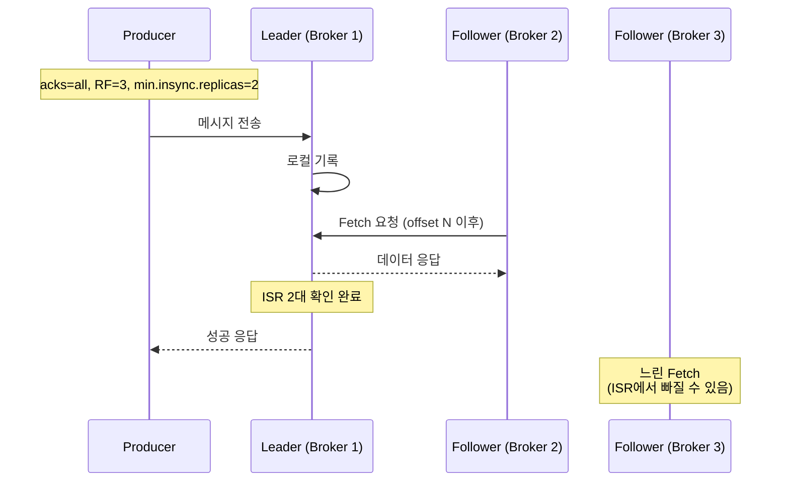
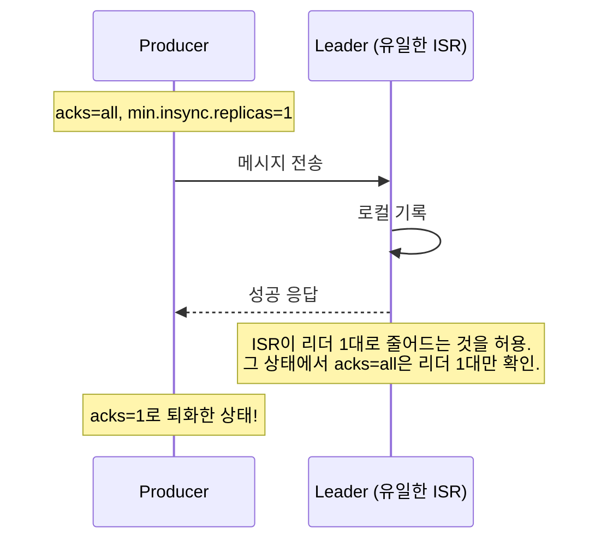
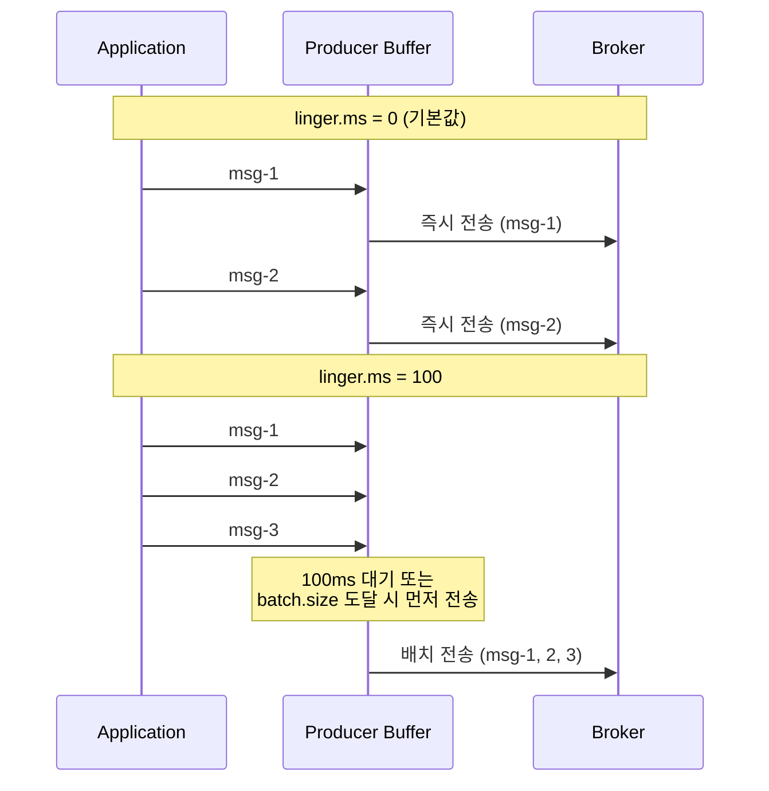
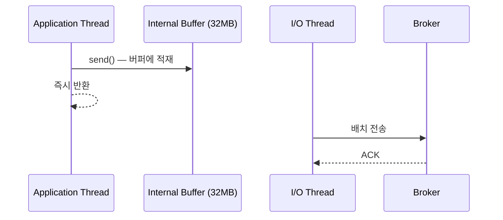

# Step 1 — Producer Guarantee + Advanced

> ISR, Replication Factor, Leader/Follower의 내부 동작이 궁금하면 [KAFKA-INTERNALS.md](../../../../KAFKA-INTERNALS.md)를 먼저 읽자.

---

## Kafka 3.0+에서 달라진 기본값을 먼저 알자

이 lab은 **Spring Boot 3.4.4 + spring-kafka 3.3.4** (Kafka 클라이언트 3.7.x)를 사용한다. Kafka 3.0부터 `enable.idempotence`의 기본값이 `true`로 변경되었고, 이게 강제하는 설정이 있다:

- `acks=all` (강제)
- `retries=Integer.MAX_VALUE` (강제)
- `max.in.flight.requests.per.connection` ≤ 5 (강제)

즉, **명시적으로 `acks`를 설정하지 않아도 이미 `acks=all`이다.** `acks=0`이나 `acks=1`을 테스트하려면 반드시 `enable.idempotence=false`를 먼저 설정해야 한다. 이 맥락을 모르면 "나는 acks 설정 안 했는데 왜 all처럼 동작하지?" 하는 혼란이 생긴다.

> ⚠️ `enable.idempotence=false`는 이 lab에서 acks 레벨별 동작을 분리 테스트하기 위한 것이다. 실무에서 끄면 재시도 시 메시지 순서 역전 등 부작용이 있다. 상세는 [Step 6 — Exactly-Once Semantics](../s06_eos/)에서 다룬다.

> 멱등 프로듀서(Idempotent Producer)가 뭔지는 지금 몰라도 된다. 여기서는 "Kafka 3.0+에서 이 기능이 기본으로 켜져 있고, 그게 acks=all을 강제한다"는 것만 알면 충분하다. 멱등 프로듀서의 동작 원리(PID + Sequence Number로 브로커 측 중복 방지)는 [Step 6 — Exactly-Once Semantics](../s06_eos/)에서 다룬다.

---

## acks=all이면 안전한 거 아닌가?

운영 환경에서 메시지 유실이 발생했다. 팀은 이미 `acks=all`을 설정해뒀다. "모든 복제본이 확인해야 응답하는 거 아닌가?" 맞다. **설정의 의미만 놓고 보면 맞다.** 근데 브로커가 1대라면?

`acks=all`은 "ISR(In-Sync Replicas) 전부가 기록을 확인해야 응답한다"는 뜻이다. 근데 ISR이 리더 1대뿐이면, 리더 1대만 확인하고 응답한다. **acks=1과 동일한 동작이다.**



> Kafka의 복제는 **pull 모델**이다. 리더가 팔로워에게 푸시하는 게 아니라, 팔로워가 리더에게 Fetch 요청을 보내서 가져간다. 리더는 각 팔로워의 fetch offset을 추적해서 ISR 충족 여부를 판단한다.

이게 실제로 안전한 조합이다. RF=3이고 `min.insync.replicas=2`이면, 리더 포함 최소 2대가 기록을 확인해야 성공 응답이 온다. 브로커 1대가 죽어도 나머지 2대에 데이터가 있다.

반대로, `min.insync.replicas=1`이면?



`min.insync.replicas`는 "ISR이 이 수 미만이면 쓰기를 거부하라"는 **하한선**이다. RF=3, ISR=3인 상태에서 `min.insync.replicas=1`이면, `acks=all`은 여전히 ISR 3대 전부를 확인한다. 문제는 ISR이 1대로 줄어드는 것을 **허용한다는 점**이다. ISR이 리더 1대로 줄어든 뒤에야 acks=1과 동일해진다.

> 이 lab은 단일 브로커(RF=1, ISR=항상 1)이므로, 테스트에서는 "항상 acks=1과 동일"이 맞다.

> **ProducerAcksTest** — `acks_all에_min_insync_replicas_1이면_사실상_acks_1이다()`에서 확인.

---

## acks의 세 가지 레벨을 구분하자

acks에는 세 가지 값이 있다. 각각이 어떤 보장을 하는지 명확히 알아야 한다.

> `acks=0`이나 `acks=1`을 테스트하려면, Kafka 3.0+ 기본값인 `enable.idempotence=true`가 `acks=all`을 강제하므로 반드시 `enable.idempotence=false`를 먼저 설정해야 한다.

**acks=0** — 브로커 응답을 기다리지 않는다. 가장 빠르지만 유실 가능성이 가장 높다. 메트릭 수집처럼 일부 유실이 허용되는 경우에만 쓴다.

> **ProducerAcksTest** — `acks_0이면_브로커_응답을_기다리지_않는다()`에서 확인.

**acks=1** — 리더만 기록을 확인하면 응답한다. 리더가 죽으면 팔로워에 아직 복제되지 않은 메시지는 유실된다.

> **ProducerAcksTest** — `acks_1이면_leader만_확인한다()`에서 확인.

**acks=all** — ISR 전부가 기록을 확인해야 응답한다. 가장 안전하지만, `min.insync.replicas`와 조합해야 의미가 있다.

> **ProducerAcksTest** — `acks_all이면_모든_ISR이_확인한다()`에서 확인.

정리하면 이렇다.

```
안전한 조합:   acks=all + min.insync.replicas=2 + RF >= 3
함정 조합:     acks=all + min.insync.replicas=1       → ISR 축소 시 acks=1로 퇴화 가능
위험한 선택:   acks=0                                  → 유실 허용할 때만
Kafka 3.0+ 기본: enable.idempotence=true → acks=all 강제
```

---

## send()의 반환값을 확인하지 않으면 성공을 보장할 수 없다

`KafkaTemplate.send()`는 `CompletableFuture<SendResult>`를 반환한다. 이 반환값을 무시하면, 발행이 실패해도 코드에서 알 수 없다.

```java
// 위험: 반환값을 무시
kafkaTemplate.send("topic", "message");

// 안전: 반환값을 확인 (타임아웃 지정)
kafkaTemplate.send("topic", "message").get(5, TimeUnit.SECONDS);

// 위험: 타임아웃 없이 무한 대기
kafkaTemplate.send("topic", "message").get();  // 브로커 불능 시 스레드가 영원히 블로킹
```

반환값인 `RecordMetadata`에서는 메시지가 어느 토픽, 어느 파티션, 어느 offset에 기록됐는지 확인할 수 있다.

> **ProducerRecordStructureTest** — `send의_반환값을_확인해야_발행_성공을_보장할_수_있다()`에서 확인.
> **ProducerRecordStructureTest** — `send의_반환값_RecordMetadata에서_메시지_구조를_확인할_수_있다()`에서 확인.

그리고 `ProducerRecord`의 Header에 `correlation-id`를 추가하면, Consumer에서 해당 메시지를 추적할 수 있다. 분산 시스템에서 요청 하나가 여러 서비스를 거칠 때, 로그에서 전체 흐름을 추적하려면 공통 ID가 필요하다. Header에 `correlation-id`를 넣는 것이 기본 패턴이고, MDC(Mapped Diagnostic Context)와 연계하면 서비스별 로그를 하나의 흐름으로 묶을 수 있다.

> **ProducerRecordStructureTest** — `Header에_correlation_id를_추가하면_Consumer에서_확인할_수_있다()`에서 확인.

---

## 배치 전송 — linger.ms와 batch.size

메시지를 하나씩 보내면 네트워크 왕복이 메시지 수만큼 발생한다. Producer는 **`linger.ms`와 `batch.size` 두 가지 조건 중 하나가 먼저 충족되면** 배치를 전송한다.

- `batch.size`(기본 16384바이트)에 도달하면 → `linger.ms`가 남아 있어도 즉시 전송
- `linger.ms` 만료 → 현재까지 모인 것 전송 (`batch.size` 미달이어도)



`linger.ms=0`이면 sender 스레드가 **의도적으로 대기하지 않는다**. 단, sender가 이전 배치를 처리하느라 바쁜 동안 버퍼에 누적된 메시지는 여전히 배치로 묶일 수 있다.

> **ProducerBatchingTest** — `linger_ms가_0이면_메시지를_즉시_전송한다()`에서 확인.

`linger.ms`를 설정하면 해당 시간만큼 버퍼에서 대기하며 배치를 모은다. 처리량이 올라간다.

> **ProducerBatchingTest** — `linger_ms를_설정하면_배치로_묶어_전송한다()`에서 확인.

그런데 배치 대기 중에 즉시 보내야 하는 상황이면? `flush()`를 호출하면 `linger.ms`를 무시하고 버퍼에 있는 메시지를 즉시 전송한다.

> **ProducerBatchingTest** — `flush를_호출하면_linger_ms를_무시하고_즉시_전송한다()`에서 확인.

---

## 백프레셔 — buffer.memory와 max.block.ms

Producer는 메시지를 바로 브로커에 보내지 않는다. 내부 버퍼(`buffer.memory`, 기본 32MB)에 먼저 쌓고, 별도 I/O 스레드가 브로커로 전송한다. `send()`는 버퍼에 넣는 것까지만 하므로 보통 즉시 반환된다.



> **ProducerBackpressureTest** — `buffer_memory가_충분하면_send는_즉시_반환된다()`에서 확인.

그런데 브로커가 응답하지 않거나 메타데이터를 못 가져오면? 버퍼가 가득 차거나 메타데이터 대기가 길어지면 `send()`가 블로킹된다. 이때 `max.block.ms`(기본 60초)가 만료되면 `TimeoutException`이 발생한다.

이건 Producer 측의 백프레셔 메커니즘이다. 브로커가 감당하지 못하는 속도로 보내는 걸 막아준다.

> **ProducerBackpressureTest** — `max_block_ms가_만료되면_send에서_TimeoutException이_발생한다()`에서 확인.

### delivery.timeout.ms — 재시도의 상한

`delivery.timeout.ms`(기본 120초)는 `send()` 호출 이후 메시지가 성공적으로 전달되기까지의 **전체 상한 시간**이다. `linger.ms` + 실제 전송 시간 + 재시도 시간을 모두 포함한다. 이 시간 안에 전달되지 못하면 `TimeoutException`으로 실패 처리된다.

```
delivery.timeout.ms >= linger.ms + request.timeout.ms
```

> `delivery.timeout.ms`는 `linger.ms + request.timeout.ms`보다 크거나 같아야 한다. 이 조건을 어기면 Producer 생성 시 `ConfigException`이 발생한다.

> `retries` 횟수와 재시도 시 순서 역전 문제는 멱등 프로듀서와 함께 [Step 6 — Exactly-Once Semantics](../s06_eos/)에서 다룬다.

---

## yml 대응

```yaml
spring.kafka.producer:
  acks: all                          # 0, 1, all (Kafka 3.0+ 기본: idempotence=true → acks=all 강제)
  properties:
    linger.ms: 5                     # 배치 대기 시간 (ms)
    batch.size: 16384                # 배치 크기 (바이트). linger.ms와 batch.size 중 먼저 충족되는 조건으로 전송
    buffer.memory: 33554432          # 전체 버퍼 (기본 32MB)
    max.block.ms: 60000              # 버퍼/메타데이터 대기 타임아웃
    delivery.timeout.ms: 120000      # send() 이후 전달 성공까지의 전체 상한

# ⚠️ min.insync.replicas는 Producer 설정이 아니다.
# 브로커 레벨(server.properties) 또는 토픽 레벨에서 설정한다.
# kafka-configs --alter --topic my-topic --add-config min.insync.replicas=2
#
# 이 lab은 단일 브로커(RF=1)이므로 min.insync.replicas는 1만 가능하다.
```

---

## 스스로 답해보자

- `acks=all`인데 `min.insync.replicas=1`이면 어떤 상황에서 위험해지는가?
- `acks=0`은 어떤 상황에서 쓸 수 있는가?
- `send()`의 반환값을 무시하면 어떤 위험이 있는가?
- `linger.ms=100`으로 설정했는데 100ms 전에 전송되는 경우가 있는가? 왜?
- 브로커가 불능 상태일 때 `send()`를 호출하면 어떤 일이 일어나는가?
- Idempotent Producer와 `acks=all`은 같은 문제를 해결하는가?
- Kafka 3.0+에서 `acks=1`로 테스트하려면 어떤 설정을 먼저 바꿔야 하는가?

> 답이 바로 나오면 Step 2로 넘어가자.
> 막히면 `ProducerAcksTest`, `ProducerBatchingTest`, `ProducerBackpressureTest`를 실행해서 확인하자.

---

## 다음 Step으로

Producer 설정으로 메시지가 브로커에 안전하게 도착하는 것까지 확인했다.
근데 **브로커에 도착한 메시지를 Consumer가 제대로 처리했는지**는 별개의 문제다.

Step 2에서는 Consumer의 offset 커밋을 다룬다.
"예외를 try-catch로 삼키면 안전한 거 아닌가?" — 이 질문에서 시작한다.