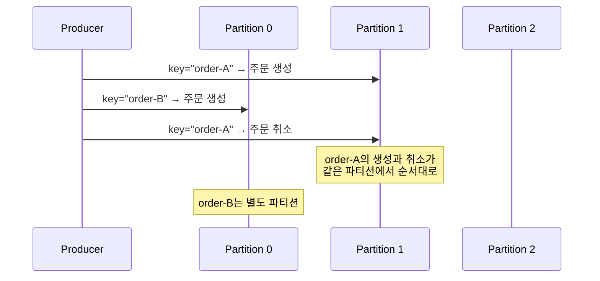
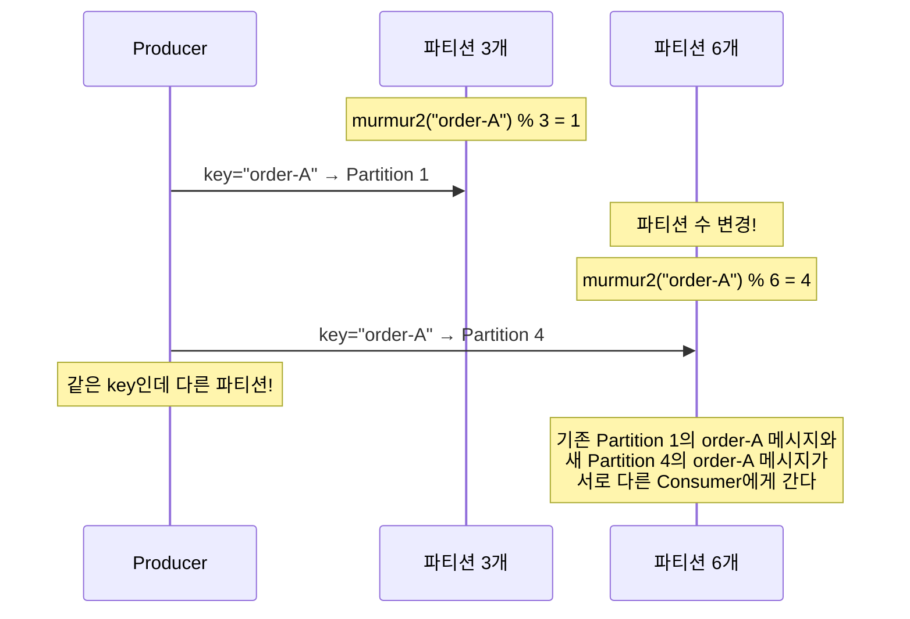
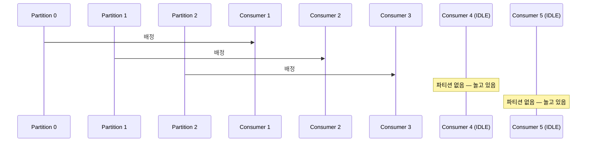

# Step 3 — Partition & Ordering + Advanced

---

## 파티션 수를 늘리면 처리량이 올라가니까 좋은 거 아닌가?

트래픽이 늘었다. Consumer 1대로는 처리가 밀린다. 파티션 수를 3에서 6으로 늘리고 Consumer도 6대로 맞췄다. 처리량이 2배가 됐다.

**근데 주문 순서가 뒤섞이기 시작했다.**

같은 고객의 주문 생성 이벤트보다 주문 취소 이벤트가 먼저 처리된다. "아직 생성 안 된 주문을 취소?"라는 에러가 터진다. 파티션 수를 늘리기 전에는 없던 문제다.

---

## key가 없으면 파티션이 분산된다

key 없이 메시지를 발행하면, Kafka는 파티션을 분산 배정한다. Kafka 2.4 이전에는 라운드로빈이었고, 이후에는 **스티키 파티셔닝**이 기본이다(이 lab의 Kafka 클라이언트 3.7.x 포함). 스티키 파티셔닝은 하나의 배치가 채워질 때까지 같은 파티션에 보내고, 배치가 차면 다른 파티션으로 넘어간다.

> Step 1에서 배운 `linger.ms`/`batch.size`와 직접 연결된다. key 없이 보냈는데 한 파티션에 메시지가 몰려 있다면, 스티키 파티셔닝이 배치를 채우는 중이기 때문이다.

> **PartitionKeyTest** — `key_없이_발행하면_파티션이_분산된다()`에서 확인.

---

## 같은 key면 같은 파티션 — 순서 보장의 핵심

같은 key로 발행하면, 기본 파티셔너는 `murmur2(key) % 파티션수`로 파티션을 결정한다. **같은 key는 항상 같은 파티션에 들어간다.** 파티션 내에서 메시지 순서가 보장되므로, 같은 key의 이벤트는 순서대로 처리된다.



같은 파티션의 메시지는 하나의 Consumer 스레드에서 순차적으로 처리되므로(Spring Kafka의 기본 동작), 락 없이 순서와 단일 처리를 보장할 수 있다.

> ⚠️ 이 전제는 **Consumer가 단일 스레드로 처리할 때만** 성립한다. Spring Kafka의 `ConcurrentKafkaListenerContainerFactory`에서 `concurrency`를 파티션 수보다 높게 설정하거나, 리스너 안에서 별도 스레드풀로 처리하면 같은 파티션의 메시지도 동시에 처리될 수 있다.

> **PartitionKeyTest** — `같은_key로_발행하면_같은_파티션에_들어가_순서가_보장된다()`에서 확인.
> **PartitionKeyTest** — `서로_다른_key는_서로_다른_파티션에_배정될_수_있다()`에서 확인.

---

## 파티션 수를 바꾸면 key 매핑이 깨진다

여기가 핵심이다. `murmur2(key) % 파티션수`에서 **파티션수가 바뀌면 나머지 연산 결과가 달라진다.**



파티션 수를 3에서 6으로 늘린 순간, `order-A`가 Partition 1에서 Partition 4로 옮겨갔다. Partition 1에 남아있는 과거 메시지는 여전히 Consumer 1이 처리하고, 새 메시지는 Consumer 4가 처리한다. **같은 key의 메시지가 두 Consumer에 분산되면서 순서 보장이 깨진다.**

> 파티션을 늘려도 **기존 파티션의 데이터는 이동하지 않는다.** 새 파티션은 비어 있는 상태로 시작하고, 이후 발행되는 메시지만 새로운 파티션 배정 규칙을 따른다.

> **PartitionRekeyTest** — `파티션_수_변경_후_같은_key가_다른_파티션에_배정된다()`에서 확인.
> **PartitionRekeyTest** — `실제_브로커에서_파티션_수_변경_전후_key_배정이_달라진다()`에서 확인.

그래서 **파티션 수는 처음에 충분히 설정하고, 변경하지 않는 것이 원칙**이다.

---

## Consumer가 파티션보다 많으면 놀리는 Consumer가 생긴다

파티션이 3개인데 Consumer를 5대로 늘리면? 2대는 파티션을 배정받지 못한다. Kafka에서 하나의 파티션은 Consumer Group 내 하나의 Consumer에게만 배정된다.



Consumer를 아무리 늘려도 파티션 수가 병렬 처리의 상한이다.

> **PartitionConsumerTest** — `Consumer_수가_파티션_수보다_많으면_놀리는_Consumer가_발생한다()`에서 확인.

---

## Spring Kafka의 concurrency와 파티션의 관계

위에서 "Consumer를 늘려도 파티션 수가 상한"이라고 했다. 그런데 Spring Kafka에서 Consumer를 늘리는 방법이 **두 가지**다.

**1. 인스턴스를 늘린다** — 서버(Pod)를 여러 대 띄운다. 같은 Consumer Group에 속하면 파티션이 분배된다.

**2. concurrency를 올린다** — 하나의 인스턴스 안에서 여러 Consumer 스레드를 만든다.

```java
@Bean
ConcurrentKafkaListenerContainerFactory<String, String> factory(
        ConsumerFactory<String, String> cf) {
    var factory = new ConcurrentKafkaListenerContainerFactory<String, String>();
    factory.setConsumerFactory(cf);
    factory.setConcurrency(3);  // 이 인스턴스에서 Consumer 스레드 3개
    return factory;
}
```

Spring Kafka의 `concurrency` 기본값은 **1**이다. 파티션이 6개인데 `concurrency=1`이면, 이 인스턴스 하나가 6개 파티션을 **단일 스레드로** 순차 처리한다. 처리량이 1/6로 줄어든다.

```
파티션 6개, 인스턴스 1대:
  concurrency=1 → 스레드 1개가 6파티션 순차 처리 (병렬성 없음)
  concurrency=3 → 스레드 3개가 각 2파티션씩 처리
  concurrency=6 → 스레드 6개가 각 1파티션씩 처리 (최대 병렬)
  concurrency=9 → 스레드 6개만 파티션 배정, 3개는 IDLE

파티션 6개, 인스턴스 2대 (concurrency=3):
  인스턴스 A: 스레드 3개 → 파티션 3개
  인스턴스 B: 스레드 3개 → 파티션 3개
  → 총 Consumer 스레드 6개 = 파티션 수와 딱 맞음
```

> **핵심: `concurrency × 인스턴스 수`가 파티션 수를 초과하면 IDLE 스레드가 생긴다.** 파티션 수 이하로 맞추는 것이 원칙이다.

> ⚠️ `concurrency > 1`이면 하나의 인스턴스에서 여러 파티션을 **병렬로** 처리한다. 서로 다른 파티션의 메시지는 동시에 처리되므로, **파티션 간 순서는 보장되지 않는다.** 같은 파티션 내의 순서만 보장된다는 점은 변하지 않는다.

---

## 실무에서 파티션 키를 어떻게 잡는가

> 파티션 키는 "공유 자원" 기준으로 잡는다.

선착순 쿠폰 발급을 예로 들면:

- 충돌이 나는 공유 자원은 "유저"가 아니라 **"쿠폰 수량"**이다
- key를 `couponId`로 잡으면, 같은 쿠폰에 대한 요청이 같은 파티션 → 같은 Consumer 스레드로 간다
- 하나의 Consumer 스레드만 해당 쿠폰을 순차 처리하므로 **동시성 문제를 락이 아니라 설계로 제거**할 수 있다

근데 특정 쿠폰에 트래픽이 폭발하면? **Hot Partition** 문제가 발생한다. 하나의 파티션에 부하가 집중되어 다른 파티션은 놀고 해당 파티션만 밀린다.

해결 방법:

```
1. Key Sharding: couponId → couponId#0 ~ couponId#N 으로 분산
2. Redis 선차단: Redis DECR로 수량 체크, 통과한 요청만 Kafka에 발행
```

**Key Sharding의 트레이드오프:** Sharding하면 같은 쿠폰의 요청이 여러 파티션으로 분산되므로 **글로벌(전체) 순서가 깨진다.** Shard 내에서는 순차 처리가 유지되지만, 전체 발급 수량을 정확히 관리하려면 **별도 글로벌 카운터(Redis 등)**가 필요하다. Shard 수는 파티션 수 이하로 잡는 것이 일반적이다(파티션보다 많으면 분산 효과가 없다).

결국 실무에서는 Redis DECR로 선착순 컷을 먼저 내고, 통과한 요청만 Kafka에 발행하는 패턴이 일반적이다.

---

## 초기 파티션 수는 어떻게 잡는가

"처음에 충분히 설정하라"고 했는데, **얼마나?**

```
브로커 수 × N (배수) 으로 시작한다.
브로커 3대 → 파티션 3, 6, 9 중 선택.

배수로 잡는 이유: 리더 파티션이 브로커 간에 균등 분배된다.
브로커 3대에 파티션 4개면, 한 브로커가 2개를 맡아 불균형해진다.

초기에는 최소한으로 시작하고,
Consumer Lag 모니터링(Step 9)을 보면서 점진적으로 늘린다.
```

파티션은 **늘릴 수는 있지만 줄일 수는 없다.** 그리고 늘리면 key 매핑이 깨진다. 그래서 처음에 "넉넉하게" 잡되, 과하게 잡지 않는 것이 중요하다.

---

## yml 대응

Step 3은 Producer/Consumer 설정보다 **토픽 설계**에 가깝다. Spring Boot에서는 `NewTopic` Bean으로 토픽을 생성할 수 있다.

```java
@Bean
NewTopic orderEvents() {
    return TopicBuilder.name("order-events")
            .partitions(6)
            .replicas(1)
            .build();
}
```

```yaml
# docker-compose 브로커 설정
KAFKA_NUM_PARTITIONS: 3              # 토픽 자동 생성 시 기본 파티션 수

# 토픽별 파티션 수는 NewTopic Bean 또는 AdminClient.createTopics()로 지정
# 운영 중 변경: kafka-topics --alter --topic order-events --partitions 6
# ⚠️ 파티션을 늘리면 기존 key 매핑이 깨진다

# Spring Kafka Consumer 병렬 처리
spring.kafka.listener:
  concurrency: 3                     # 인스턴스당 Consumer 스레드 수 (기본값: 1)
                                     # concurrency × 인스턴스 수 ≤ 파티션 수 가 원칙
```

---

## 스스로 답해보자

- key 없이 발행하면 파티션은 어떻게 결정되는가? Kafka 3.x에서 기본 전략은?
- 같은 key가 같은 파티션에 가는 원리는 무엇인가?
- 파티션 수를 변경하면 기존 key의 매핑은 어떻게 되는가? 기존 파티션의 데이터는?
- 파티션이 3개인데 Consumer를 10대로 늘리면 처리량이 올라가는가?
- 파티션이 6개인데 `concurrency=1`이면 어떤 문제가 생기는가?
- `concurrency × 인스턴스 수`가 파티션 수를 초과하면 어떻게 되는가?
- 선착순 쿠폰에서 key를 userId가 아니라 couponId로 잡는 이유는?
- Hot Partition이 발생하면 어떻게 대응하는가?
- "같은 파티션이면 순서 보장"이 깨지는 경우는?

> 답이 바로 나오면 Step 4로 넘어가자.
> 막히면 `PartitionKeyTest`, `PartitionRekeyTest`, `PartitionConsumerTest`를 실행해서 확인하자.

---

## 다음 Step으로

파티션과 Consumer의 관계를 이해했다.
근데 Consumer를 추가하거나 제거하면 **파티션 재배정(리밸런싱)**이 발생한다.

Step 4에서는 리밸런싱의 종류와 그 과정에서 생기는 문제를 다룬다.
"Consumer를 롤링 배포하면 왜 순간적으로 처리가 멈추는가?" — 이 질문에서 시작한다.