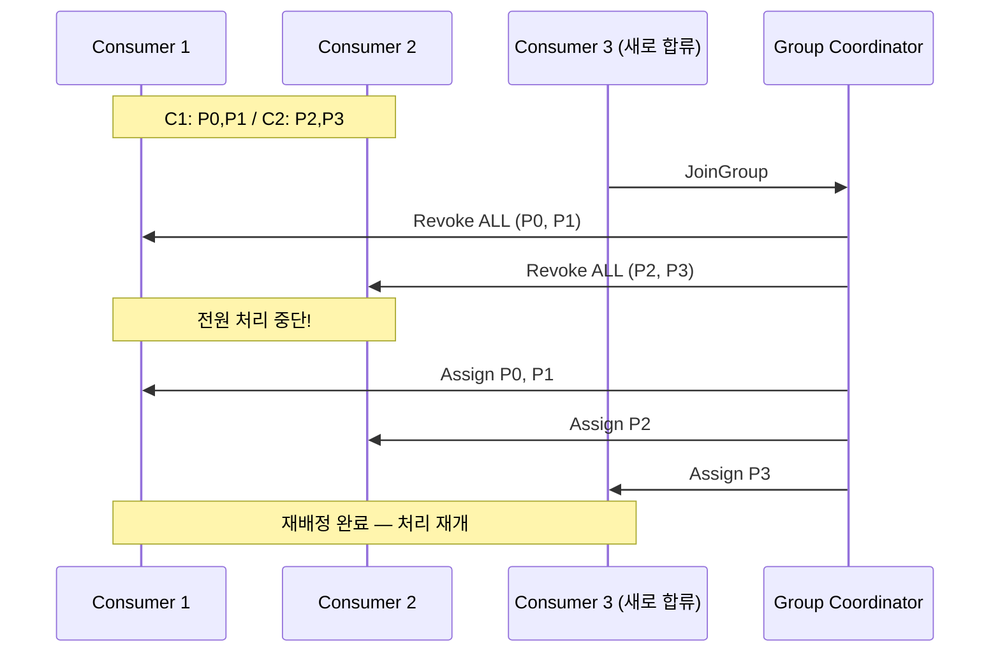
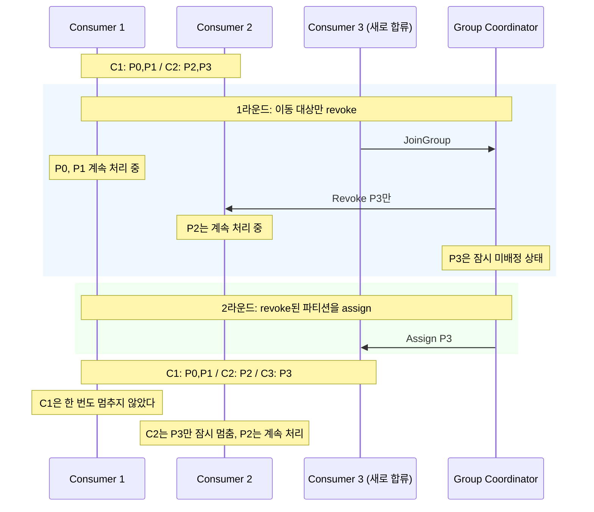
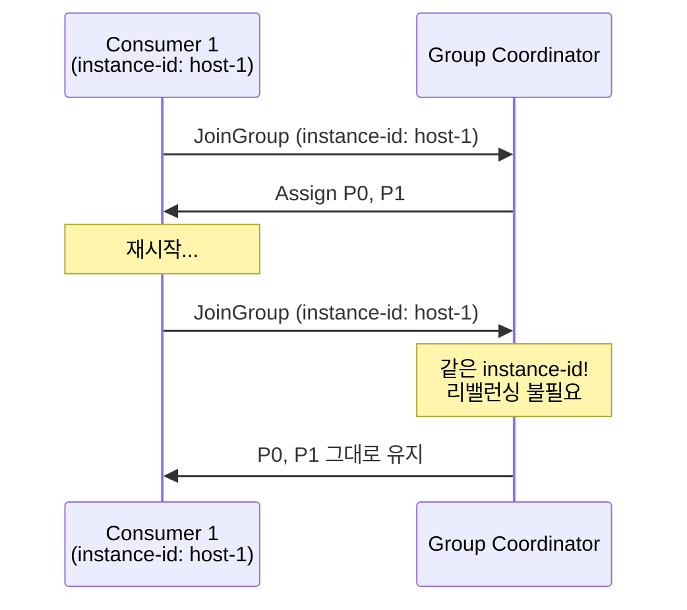
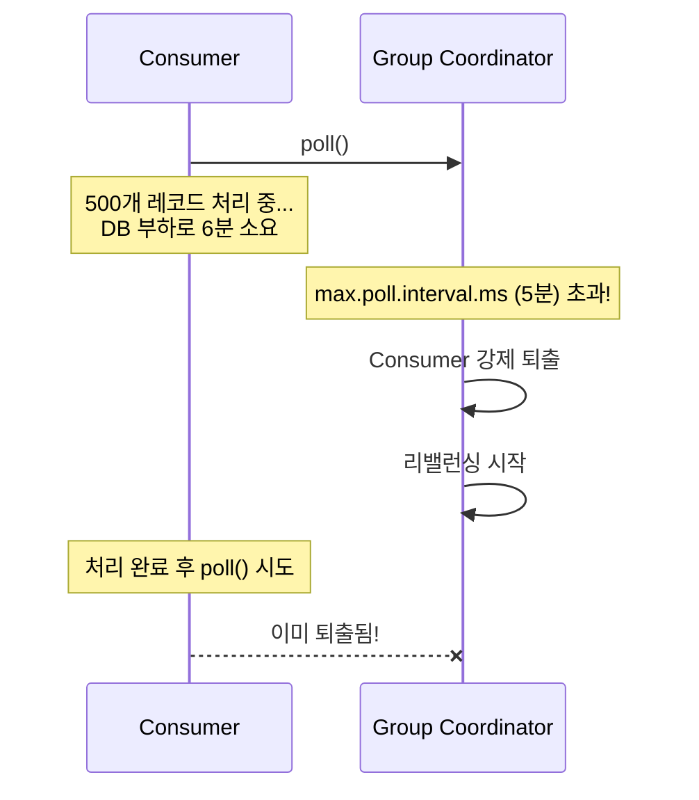

# Step 4 — Rebalancing

> Group Coordinator가 리밸런싱을 어떻게 조율하는지 내부 동작이 궁금하면 [KAFKA-ARCHITECTURE.md](../../../../KAFKA-ARCHITECTURE.md)를 먼저 읽자.

---

## Consumer를 롤링 배포하면 왜 순간적으로 처리가 멈추는가?

3대의 Consumer가 6개 파티션을 나눠 처리하고 있다. 코드를 배포하려고 Consumer를 하나씩 재시작했다. 첫 번째 Consumer를 내리는 순간, **나머지 2대도 처리를 멈췄다.** 몇 초 뒤에 다시 살아나긴 했지만, 그 사이에 Lag이 쌓였다.

이게 **Eager 리밸런싱**이다.

---

## Eager — 전부 멈추고 다시 나눈다

Eager 방식에서는 Consumer Group에 변경이 생기면 **모든 파티션을 회수(revoke)하고 다시 배분한다.** Stop-the-World다. RangeAssignor, RoundRobinAssignor 모두 Eager 프로토콜이다.



Consumer 3이 합류했을 뿐인데, Consumer 1과 2도 가지고 있던 파티션을 전부 반납했다. P0과 P1은 어차피 다시 Consumer 1에게 돌아갔는데 왜 굳이 뺏었다가 돌려주는가? **Eager 프로토콜이 그렇게 동작하기 때문이다.**

> **RebalancingEagerVsCooperativeTest** — `Eager_리밸런싱에서는_새_Consumer_합류_시_모든_파티션이_revoke된다()`에서 확인.

---

## Cooperative — 이동이 필요한 파티션만 옮긴다

Cooperative(CooperativeStickyAssignor) 방식에서는 **실제로 이동이 필요한 파티션만 revoke한다.** 나머지 Consumer는 기존 파티션을 계속 처리한다.

Cooperative는 **2라운드(이상)**로 동작한다:



> 1라운드와 2라운드 사이에 P3의 메시지는 처리되지 않지만, P0/P1/P2는 **계속 처리 중**이다. Eager처럼 전체가 멈추는 것과는 근본적으로 다르다.

> **RebalancingEagerVsCooperativeTest** — `Cooperative_리밸런싱에서는_이동이_필요한_파티션만_revoke된다()`에서 확인.

---

## 프로토콜 3세대

| 세대 | 프로토콜 | 동작 | 처리 중단 |
|------|---------|------|----------|
| 1세대 | **Eager** (RangeAssignor, RoundRobinAssignor) | 전체 파티션 revoke → 재배분 | 전체 멈춤 (Stop-the-World) |
| 2세대 | **Cooperative** (CooperativeStickyAssignor) | 이동 파티션만 revoke, 나머지 계속 처리 | 이동 파티션만 잠깐 멈춤 |
| 3세대 | **KIP-848** (Kafka 4.0 예정) | 리밸런싱 로직이 서버(Coordinator)로 이동, 증분 방식 | Stop-the-World 완전 제거 |

> **Kafka 3.0+ 기본값:** `partition.assignment.strategy`가 `[RangeAssignor, CooperativeStickyAssignor]` 두 개가 동시에 설정되어 있다. Group 내 모든 Consumer가 CooperativeStickyAssignor를 지원하면 자동으로 Cooperative로 전환된다. **신규 프로젝트라면 `CooperativeStickyAssignor`만 명시하는 게 깔끔하다.**

---

## Static Membership — 재접속해도 리밸런싱 없이

Dynamic Membership(기본값)에서는 Consumer가 재접속할 때마다 새 멤버로 인식된다. 재시작할 때마다 리밸런싱이 발생한다.

`group.instance.id`를 설정하면 **Static Membership**이 활성화된다. 같은 ID로 재접속하면 이전에 가지고 있던 파티션을 그대로 돌려받는다. 리밸런싱 없이.



> **StaticMembershipTest** — `Static_Membership_없이_재접속하면_리밸런싱이_발생한다()`에서 확인.
> **StaticMembershipTest** — `Static_Membership으로_재접속_시_같은_파티션을_유지한다()`에서 확인.

Kubernetes 환경에서는 `group.instance.id`를 `${HOSTNAME}`(Pod 이름)으로 설정하는 것이 일반적이다.

---

## 퇴출 메커니즘은 두 가지다

Consumer가 "죽었다"고 판단되면 Group Coordinator가 강제 퇴출한다. 퇴출을 감지하는 메커니즘은 두 가지다.

**session.timeout.ms (기본 45초)** — heartbeat 스레드가 이 시간 내에 heartbeat를 못 보내면 퇴출된다. Consumer 프로세스 자체가 죽거나 네트워크가 끊긴 경우를 감지한다.

**max.poll.interval.ms (기본 5분)** — 애플리케이션 스레드가 poll() 간격이 이 시간을 초과하면 퇴출된다. 프로세스는 살아 있지만 처리가 느린 경우를 감지한다.



퇴출되면 해당 Consumer가 처리 중이던 메시지의 offset은 커밋되지 않는다. 다른 Consumer가 같은 메시지를 다시 받게 된다. **중복 처리 발생.**

> **MaxPollIntervalTest** — `max_poll_interval을_초과하면_Consumer가_강제_퇴출된다()`에서 확인.

해결 방법은 `max.poll.records`를 줄이는 것이다. 한 번에 적게 가져오면 처리 시간이 짧아져서 `max.poll.interval.ms` 내에 다음 `poll()`을 호출할 수 있다.

```
조정 공식: 레코드 1건 처리 시간 × max.poll.records < max.poll.interval.ms
```

> **MaxPollIntervalTest** — `max_poll_records를_줄이면_퇴출을_방지할_수_있다()`에서 확인.

---

## 리밸런싱과 중복의 관계

리밸런싱 중에 중복이 발생할 수 있다. Cooperative에서도 마찬가지다.

```
Consumer A가 P1의 msg-102를 처리 중에 리밸런싱 시작
→ onPartitionsRevoked(P1) 호출
→ A는 offset 101까지만 커밋 (102는 처리 중이라 커밋 못 함)
→ P1이 Consumer C에게 배정됨
→ C가 offset 101부터 읽기 시작 → msg-102를 또 처리 (중복!)
```

| 상황 | 중복 발생? |
|------|-----------|
| 정상 종료 (graceful, SIGTERM) | Spring Kafka가 onPartitionsRevoked에서 pending offset을 자동 커밋하므로 거의 안 생김 |
| 비정상 종료 (crash, OOM) | 커밋 기회 없음 → 생길 수 있음 |
| session timeout 만료 | 강제 revoke → 생길 수 있음 |
| 처리 중 revoke (Cooperative) | 처리 완료 + 커밋 전이면 생길 수 있음 |

### 중복의 진짜 원인 — 리밸런싱은 3순위

```
1순위: At-Least-Once 재전달 (처리 후 offset 커밋 전 crash)  ← 대부분
2순위: 릴레이 중복 발행 (Outbox SENT 전환 전 crash)
3순위: 리밸런싱 중 타이밍 이슈                              ← 드물지만 존재
```

**1순위, 2순위, 3순위 전부 → `event_id` UNIQUE 제약 하나로 막힌다.**

원인이 뭐든 — crash든, 리밸런싱이든, 릴레이 중복이든 — 같은 eventId로 2번 오면 UNIQUE가 거부한다. 그래서 **멱등 처리가 "모든 원인의 중복"에 대한 범용 해법**이다.

---

## yml 대응

```yaml
spring.kafka.consumer:
  properties:
    partition.assignment.strategy: org.apache.kafka.clients.consumer.CooperativeStickyAssignor
    group.instance.id: ${HOSTNAME}     # Kubernetes에서 권장
    session.timeout.ms: 45000          # heartbeat 기반 퇴출 (프로세스 죽음/네트워크 단절)
    heartbeat.interval.ms: 3000        # session.timeout.ms의 1/3 이하 권장
    max.poll.interval.ms: 300000       # poll 간격 기반 퇴출 (느린 처리 로직)
    max.poll.records: 500              # 레코드 1건 처리 시간 × 이 값 < max.poll.interval.ms
```

---

## 스스로 답해보자

- Eager 리밸런싱에서 Consumer 1대가 합류하면 나머지 Consumer에게 무슨 일이 생기는가?
- Cooperative에서 revoke된 파티션은 즉시 새 Consumer에게 배정되는가?
- `group.instance.id`를 설정하면 재시작 시 리밸런싱이 발생하지 않는 이유는?
- `session.timeout.ms`와 `max.poll.interval.ms`는 각각 어떤 상황을 감지하는가?
- `max.poll.interval.ms`를 초과하면 어떤 일이 연쇄적으로 발생하는가?
- 리밸런싱 중 중복이 발생하는 시나리오를 설명할 수 있는가?
- 중복 방어의 범용 해법은 무엇인가?

> 답이 바로 나오면 Step 5로 넘어가자.
> 막히면 `RebalancingEagerVsCooperativeTest`, `StaticMembershipTest`, `MaxPollIntervalTest`를 실행해서 확인하자.

---

## 다음 Step으로

리밸런싱, 퇴출, 중복까지 다뤘다.
근데 Consumer에서 **예외가 계속 발생하면** 그 메시지는 어떻게 되는가?

Step 5에서는 에러 핸들링과 DLQ(Dead Letter Queue)를 다룬다.
"Spring Kafka의 기본 에러 핸들러가 DLQ로 보내주는 거 아닌가?" — 아니다.