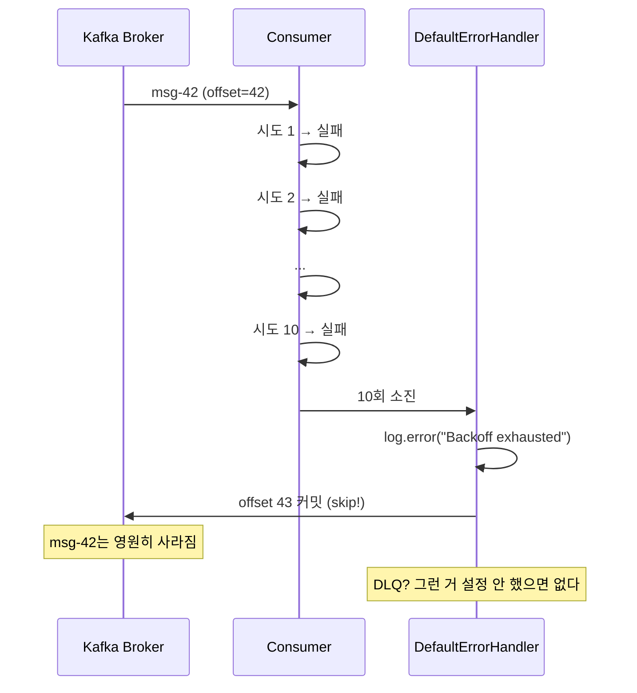
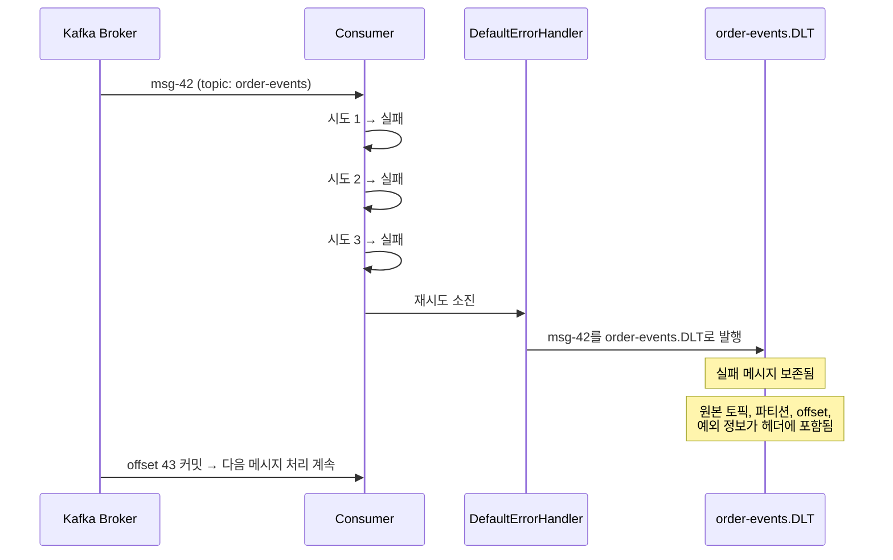

# Step 5 — DLQ & Error Handling

---

## Spring Kafka의 기본 에러 핸들러가 DLQ로 보내주는 거 아닌가?

`@KafkaListener`에서 예외가 터졌다. 재시도를 몇 번 하더니 결국 실패했다. "실패한 메시지는 DLQ(Dead Letter Queue)로 가겠지?"

**아니다. 기본 동작은 최대 10회 시도 후 skip(버림)이다.**

Spring Kafka의 `DefaultErrorHandler`는 기본적으로 `FixedBackOff(0L, 9)` — 즉, 0ms 간격으로 9번 재시도, 총 10번 시도 후 실패하면 **메시지를 버리고 다음으로 넘어간다.** 로그만 남긴다. DLQ로 보내지 않는다.



> **DefaultErrorHandlerTrapTest** — `DefaultErrorHandler_기본_동작은_재시도_후_skip이다_DLQ가_아니다()`에서 확인.

설정 없이 운영하면 실패 메시지가 **조용히 사라진다.** 로그를 꼼꼼히 보지 않으면 유실된 줄도 모른다.

### 모든 예외를 재시도하는 건 아니다

`DefaultErrorHandler`는 **Non-retryable로 분류된 예외는 재시도 없이 즉시 skip**(또는 DLQ)한다. `DeserializationException`, `ClassCastException` 등이 여기에 해당한다. 아무리 재시도해도 같은 결과이기 때문이다.

"10회 재시도하겠지"라고 생각했는데 역직렬화 에러는 1회 만에 skip되는 상황이 실무에서 발생한다. `addNotRetryableExceptions()` / `addRetryableExceptions()`로 분류를 커스터마이징할 수 있다.

> Non-retryable 예외와 역직렬화 문제는 [Step 7 — Serialization & Schema](../s07_serialization/)에서 자세히 다룬다.

---

## DLQ를 설정하면 실패한 메시지가 보존된다

DLQ로 보내려면 `DeadLetterPublishingRecoverer`를 명시적으로 설정해야 한다.

```java
@Bean
DefaultErrorHandler errorHandler(KafkaTemplate<String, String> template) {
    DeadLetterPublishingRecoverer recoverer =
        new DeadLetterPublishingRecoverer(template);
    return new DefaultErrorHandler(recoverer, new FixedBackOff(1000L, 2));
}
```

이제 3회 시도(최초 1 + 재시도 2) 후 실패하면, 메시지가 `{원본토픽}.DLT` 토픽으로 이동한다.

> 실무에서는 `FixedBackOff` 대신 `ExponentialBackOffWithMaxRetries`를 쓰는 경우가 많다. 일시적 장애(DB 순간 불능, 네트워크 타임아웃) 시 간격을 점점 늘려 시스템에 회복 시간을 준다.



> **DefaultErrorHandlerTrapTest** — `DLQ를_설정하면_실패한_메시지가_DLT_토픽으로_이동한다()`에서 확인.

DLT 토픽에는 원본 메시지뿐 아니라, 어느 토픽의 어느 파티션 어느 offset에서 왔는지, 어떤 예외가 발생했는지가 헤더에 기록된다. 이 정보로 원인을 분석하고 재처리할 수 있다.

> ⚠️ DLT 토픽은 자동으로 생성되지 않을 수 있다. 브로커의 `auto.create.topics.enable=false`인 환경(운영에서 일반적)에서는 DLT 토픽을 미리 만들어둬야 한다. 없으면 DLQ 발행 자체가 실패한다.

---

## DLT를 방치하면 안 된다

DLT에 메시지를 보내는 것은 첫 번째 단계다. DLT 토픽을 **별도 Consumer가 모니터링하고 재처리하는 로직**이 있어야 한다. DLT에 메시지가 쌓이기만 하고 아무도 안 보면, DLQ가 없는 것이나 마찬가지다.

운영에서 고려할 것:

```
1. DLT 토픽에 Consumer를 달아서 알림 발송 (Slack, PagerDuty 등)
2. 주기적으로 DLT 메시지를 원본 토픽으로 재발행 (수동 또는 자동)
3. DLT 메시지의 retention 기간 설정 (영구 보관은 디스크 문제)
4. DLT 메시지 건수를 메트릭으로 수집하여 모니터링
```

---

## yml 대응

```yaml
# Spring Kafka 기본: DLQ 없음 (최대 10회 시도 후 skip)
# DLQ 설정은 코드로 Bean 등록 필요:
#   @Bean DefaultErrorHandler(DeadLetterPublishingRecoverer, BackOff)
#
# DLT 토픽은 브로커의 auto.create.topics.enable=false면 미리 생성 필요
```

---

## 스스로 답해보자

- Spring Kafka의 `DefaultErrorHandler` 기본 동작은 무엇인가? 총 몇 번 시도하는가?
- DLQ 설정 없이 운영하면 실패한 메시지는 어디로 가는가?
- `DeserializationException`이 발생하면 재시도되는가?
- `DeadLetterPublishingRecoverer`는 실패 메시지를 어느 토픽으로 보내는가?
- DLT 토픽의 메시지 헤더에는 어떤 정보가 담겨있는가?
- DLT 토픽에 메시지가 쌓이기만 하면 어떤 문제가 생기는가?
- `FixedBackOff(1000L, 2)`에서 두 번째 인자가 의미하는 것은?

> 답이 바로 나오면 Step 6으로 넘어가자.
> 막히면 `DefaultErrorHandlerTrapTest`를 실행해서 기본 동작과 DLQ 동작의 차이를 직접 확인하자.

---

## 다음 Step으로

실패한 메시지를 DLQ로 보내서 보존하는 것까지 다뤘다.
근데 **같은 메시지가 두 번 처리되는 건** 어떻게 막는가?

Step 6에서는 Exactly-Once Semantics를 다룬다.
"Kafka가 Exactly-Once를 지원하니까 중복 걱정 없는 거 아닌가?" — 아니다.