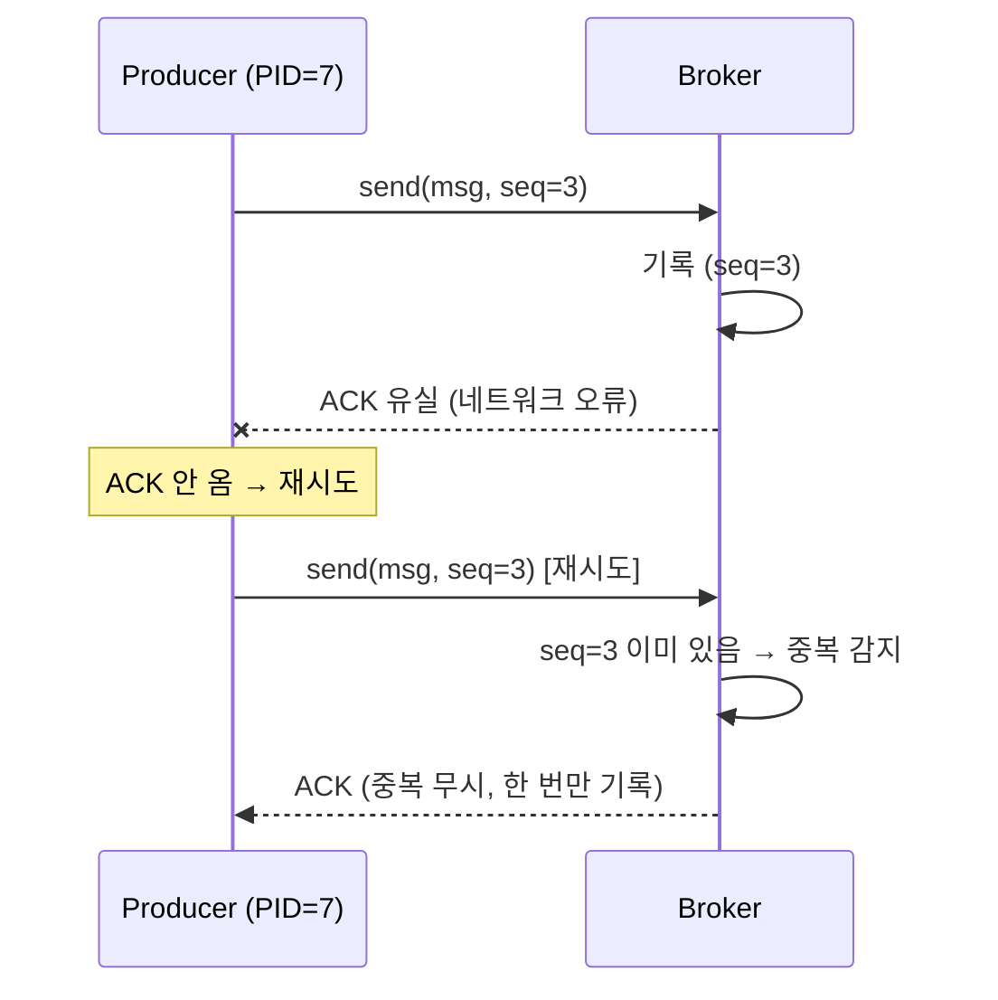
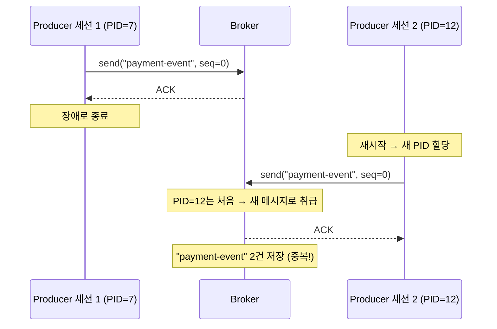
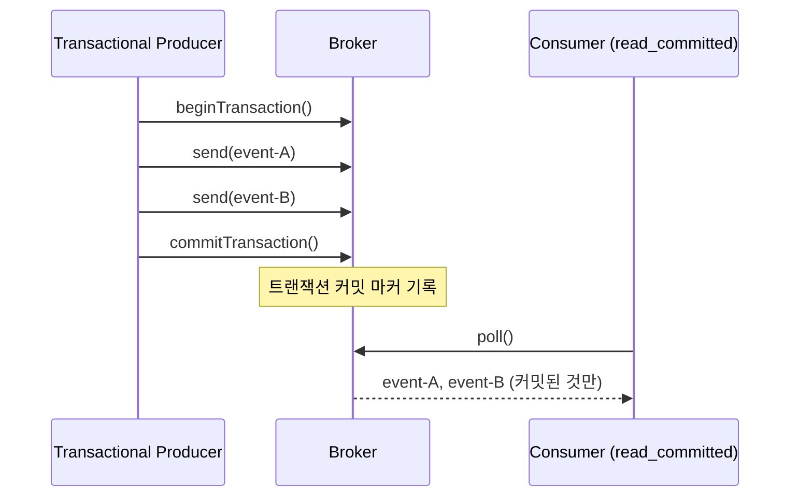
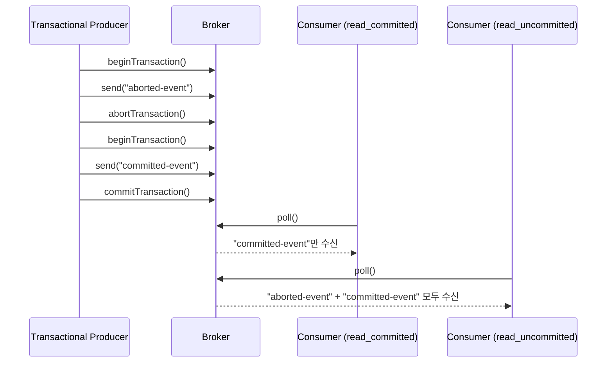
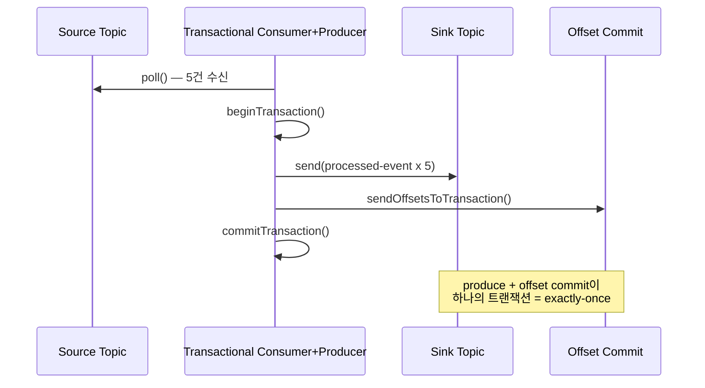
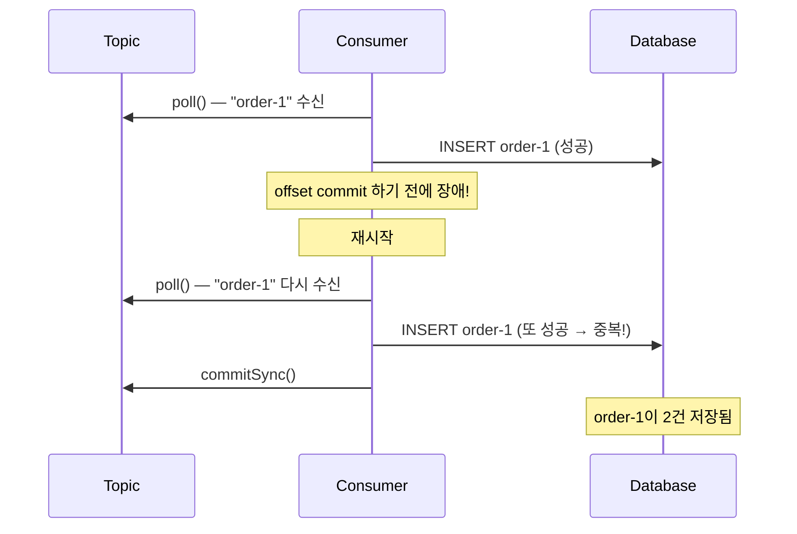
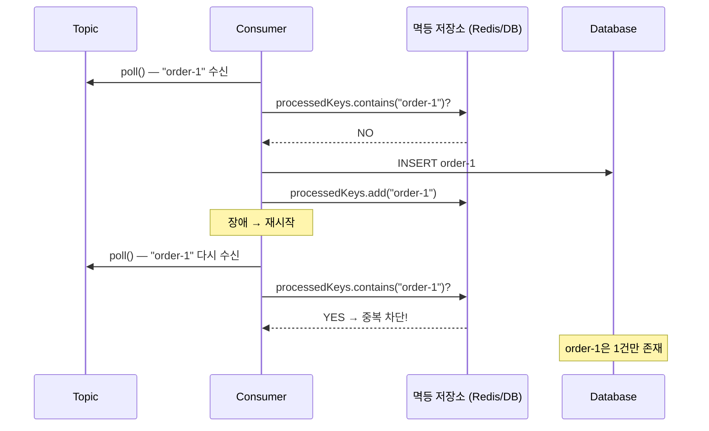

# Step 6 — Exactly-Once Semantics

---

## Kafka가 Exactly-Once를 지원하니까 중복 걱정 없는 거 아닌가?

Step 5에서 실패한 메시지를 DLQ로 보내 유실을 방지했다. 그런데 팀에서 이런 질문이 나온다. "Kafka가 Exactly-Once Semantics(EOS)를 지원하잖아. 그러면 중복도, 유실도 없는 거 아닌가?"

**아니다.** EOS는 Kafka 내부에서만 보장된다. Consumer가 메시지를 받아 DB에 insert하는 순간, 그건 EOS의 보장 범위 밖이다.

이 Step에서는 그 경계를 정확히 확인한다.

---

## 멱등 프로듀서 — 브로커 안에서의 중복 방지

먼저 가장 기본적인 안전 장치부터 보자. 멱등 프로듀서(Idempotent Producer)는 kafka-clients 3.0+에서 기본으로 활성화된다. 네트워크 오류로 브로커가 ACK를 보내지 못했을 때, Producer가 재시도하면 브로커가 PID + Sequence Number로 중복을 감지한다.



> 다이어그램의 `seq=3`은 내부 동작을 단순화한 것이다. 실제로 애플리케이션이 sequence number를 직접 지정하는 것은 아니고, Producer 내부에서 자동으로 관리된다.

핵심은 **같은 세션(같은 PID) 내에서, 네트워크 재시도에 의한 중복만** 방지한다는 것이다. 애플리케이션이 같은 내용을 두 번 `send()`하는 건 막지 않는다.

> **IdempotentProducerTest** — `멱등_프로듀서는_같은_세션_내에서_재시도_중복을_방지한다()`에서 확인.

그러면 Producer가 재시작되면? 새 Producer ID가 할당된다. 이전 세션의 seq=3을 기억하지 못하니까, 같은 메시지를 다시 보내면 **중복 저장된다.**



> **IdempotentProducerTest** — `Producer_재시작_후_같은_메시지_발행하면_중복_저장된다()`에서 확인.

> Idempotent Producer는 브로커 안에서 중복 방지. Outbox 패턴은 DB와 Kafka 사이의 유실 방지. 보장 범위가 다른 안전 장치다.

---

## 트랜잭셔널 프로듀서 — 원자적 발행

멱등 프로듀서의 한계를 넘으려면 트랜잭셔널 프로듀서를 사용한다. `beginTransaction()` → `send()` → `commitTransaction()`으로 여러 메시지를 하나의 트랜잭션으로 묶는다.



커밋되면 모두 보이고, abort되면 모두 안 보인다. 단, **Consumer의 `isolation.level`이 `read_committed`일 때만** 이 보장이 성립한다.

> **TransactionalProducerTest** — `트랜잭셔널_프로듀서로_원자적_발행을_할_수_있다()`에서 확인.

abort된 트랜잭션은 어떻게 되는가?



> **TransactionalProducerTest** — `트랜잭션_abort_시_read_committed_Consumer는_메시지를_볼_수_없다()`에서 확인.

여기서 함정이 있다. Consumer의 `isolation.level` 기본값은 **`read_uncommitted`**다. 트랜잭셔널 프로듀서를 설정해놓고 Consumer 설정을 안 바꾸면, abort된 메시지도 보인다. 트랜잭션의 의미가 없어진다.

> **TransactionalProducerTest** — `read_committed와_read_uncommitted의_차이를_확인한다()`에서 확인.

---

## EOS의 진짜 경계 — Kafka 안과 밖

이 Step에서 가장 중요한 부분이다. 트랜잭셔널 프로듀서가 보장하는 것은 **Kafka 내부의 원자성**이다. produce + consume offset commit을 하나의 트랜잭션으로 묶으면, Kafka-to-Kafka 파이프라인에서는 exactly-once가 보장된다.



> `sendOffsetsToTransaction()`은 Consumer Group ID를 인자로 받는다:
> ```java
> producer.sendOffsetsToTransaction(offsets, new ConsumerGroupMetadata(groupId));
> ```

> **EOSBoundaryTest** — `Kafka_내부_produce에서_consume_offset까지는_exactly_once가_보장된다()`에서 확인.

**그런데 Consumer가 메시지를 받아 DB에 insert하는 시나리오는?**



DB insert 후 offset commit 전에 장애가 나면, 재시작 시 같은 메시지를 다시 받는다. DB에는 이미 들어가 있는데 또 insert한다. **EOS는 이걸 막아주지 않는다.** Kafka와 DB는 서로 다른 시스템이라 하나의 트랜잭션으로 묶을 수 없기 때문이다.

> **EOSBoundaryTest** — `Consumer에서_DB_insert_후_장애나면_DB에_중복이_발생한다_EOS_범위_밖()`에서 확인.

> Outbox 패턴의 본질도 여기서 나온다. DB와 Kafka는 서로 다른 시스템이라 원자적 발행이 불가능하다. 같은 DB 트랜잭션에 아웃박스 레코드를 저장하고 별도 프로세스가 Kafka에 발행하는 것이다. Outbox 패턴의 상세 구현은 [messaging-lab](../../messaging-lab/)에서 다룬다.

---

## Consumer 멱등키 — 최종 방어선

EOS 범위 밖의 중복은 **Consumer가 직접 방어해야 한다.** 멱등키(idempotency key)를 사용한다.



> **EOSBoundaryTest** — `Consumer_측_멱등키로_외부_시스템_중복을_방어한다()`에서 확인.

멱등 처리에는 두 가지 접근이 있다.

| 분류 | 설명 | 예시 | 처리 방식 |
|------|------|------|----------|
| 멱등 상태 전이 | 같은 전이를 다시 적용해도 결과가 같음 | 주문상태: 대기→완료 (이미 완료면 무시) | UPSERT, 상태 비교 후 skip |
| 반드시 한 번만 처리 | 중복 시 어뷰징/오류 발생 | 좋아요 카운트, 랭킹 집계 | 이벤트 ID 기록 + 중복 체크 |

왜 가능하면 1번(멱등 상태 전이)으로 설계하는가? **2번이 복잡하고 비용이 크기 때문이다.** 이벤트 ID를 기록하려면 레코드가 수억 개씩 쌓일 수 있다. 멱등 저장소로 DB를 쓰면 파티셔닝/보관 주기 관리가 복잡하고, **Redis(시간 기반 TTL)**가 운영 편의 면에서 더 나은 경우가 많다.

---

## 전체 그림 — Producer-Consumer 비대칭 원칙

이 Step의 모든 내용을 관통하는 설계 원칙이 하나 있다.

> **Producer는 공격적으로 재시도한다. Consumer가 그것을 안전하게 만든다.**

Producer 쪽에서 메시지 유실을 막으려면 재시도를 해야 한다. 재시도하면 중복이 생긴다. 이건 **의도된 비대칭**이다. Producer가 중복을 허용하더라도 보내는 것이 안 보내는 것보다 낫고, Consumer가 멱등 처리로 중복을 걸러내면 end-to-end로 exactly-once 효과를 얻는다.

이 비대칭을 기반으로 전체 장애 복구는 3단계로 동작한다.

```
1단계 — 유실 방지
   도메인 저장 + 이벤트 기록을 같은 TX로 커밋.
   Kafka 발행 전에 서버가 죽어도 이벤트는 DB에 남아있다. (Outbox 패턴)

2단계 — 전달 보장
   릴레이가 미발행 이벤트를 Kafka에 발행. 실패 시 재시도.
   → At Least Once 발행 보장.

3단계 — 중복 방어
   같은 메시지가 2번 와도 event_id UNIQUE 제약으로 차단.
   → 결과적으로 Exactly Once 처리 효과.
```

**1단계는 유실을 막고, 2단계는 전달을 보장하고, 3단계는 중복을 걸러낸다.** 이 세 단계가 합쳐져서 "메시지가 정확히 한 번 처리된다"는 보장이 만들어진다.

> Outbox 패턴(1단계, 2단계)의 구체적 구현 — 릴레이 방식(Polling/CDC), 발행 확인(Self-Consume), 상태 관리(PENDING/SENT) — 은 [messaging-lab](../../messaging-lab/)에서 다룬다.

---

## yml 대응

```yaml
spring.kafka.producer:
  transaction-id-prefix: tx-          # 트랜잭셔널 프로듀서 활성화
                                      # ⚠️ 인스턴스별 고유해야 함 (예: tx-${HOSTNAME}-)
                                      # 같은 prefix가 겹치면 zombie fencing으로 이전 Producer가 죽는다
  acks: all                           # 트랜잭션 시 필수

spring.kafka.consumer:
  properties:
    isolation.level: read_committed   # 기본값은 read_uncommitted!
```

---

## 스스로 답해보자

- 멱등 프로듀서는 어떤 범위에서 중복을 방지하는가? Producer가 재시작되면?
- 트랜잭셔널 프로듀서를 설정했는데 Consumer가 abort된 메시지를 보게 됐다. 뭘 빼먹었는가?
- Kafka EOS가 보장하는 범위는 어디까지인가? DB insert는?
- Consumer가 메시지를 처리하고 offset commit 전에 죽었다. 재시작하면 어떻게 되는가?
- 멱등 처리를 "멱등 상태 전이"로 설계하는 것이 왜 우선인가?
- 멱등 저장소로 Redis를 쓰는 것이 DB보다 나은 경우는?

> 답이 바로 나오면 Step 7로 넘어가자.
> 막히면 `IdempotentProducerTest`, `TransactionalProducerTest`, `EOSBoundaryTest`를 실행해서 확인하자.

---

## 다음 Step으로

EOS의 보장 범위와 그 밖에서의 방어 전략을 확인했다.
근데 메시지를 주고받으려면 **직렬화/역직렬화**가 필요하다. Producer가 필드를 하나 추가했는데 Consumer가 죽는다면?

Step 7에서는 JSON 직렬화와 스키마 진화를 다룬다.
"Producer가 필드를 하나 추가했는데 왜 Consumer가 죽는가?" — 이 질문에서 시작한다.