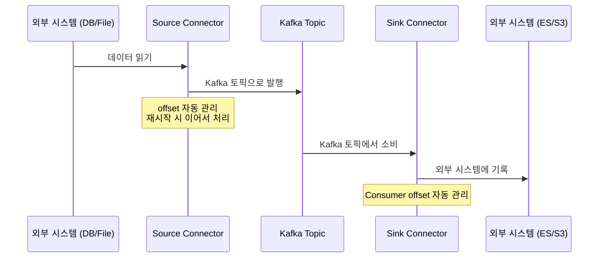
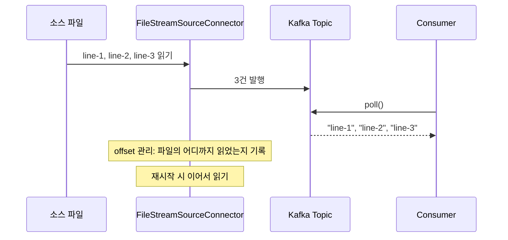
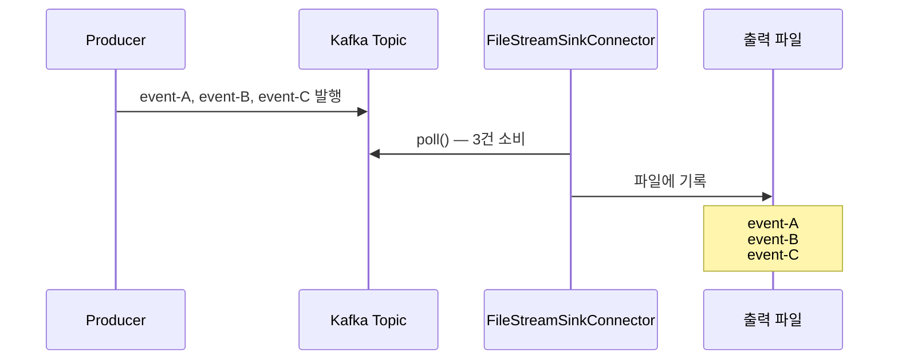
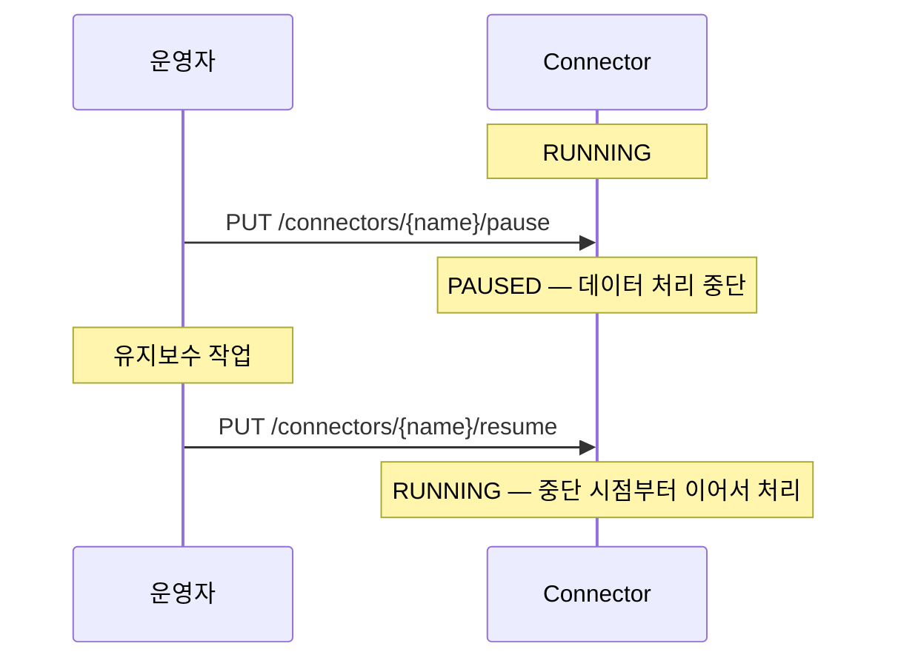

# Step 8 — Kafka Connect

---

## DB 변경사항을 Kafka로 보내려면 Producer를 직접 짜야 하나?

Step 7에서 직렬화와 스키마 호환성을 다뤘다. 이제 데이터를 **어떻게 파이프라인으로 연결하는지** 보자.

DB에서 변경된 주문 데이터를 Kafka 토픽으로 보내고, 다시 Kafka에서 Elasticsearch로 내보내야 한다. 매번 Producer/Consumer를 직접 짜면, 장애 시 offset 관리, 재시작 복구, 스키마 변환을 모두 직접 구현해야 한다.

**Kafka Connect를 쓰면 설정만으로 데이터 파이프라인을 만들 수 있다.** 코드 한 줄 없이 REST API로 관리한다.

---

## Connect의 구조 — Source와 Sink

Kafka Connect는 크게 두 종류의 Connector로 나뉜다.



- **Source Connector**: 외부 시스템 → Kafka 토픽 (실무: Debezium CDC, JDBC Source)
- **Sink Connector**: Kafka 토픽 → 외부 시스템 (실무: S3 Sink, Elasticsearch Sink, JDBC Sink)

Connect가 **offset을 자동 관리**하므로, Connector가 재시작되면 마지막으로 읽은 위치부터 이어서 처리한다. Distributed 모드에서 offset은 Kafka 내부 토픽(`connect-offsets`)에 저장된다.

### Standalone vs Distributed 모드

Kafka Connect는 **Standalone 모드**(단일 프로세스)와 **Distributed 모드**(여러 Worker가 클러스터)로 동작한다. 이 lab은 Distributed 모드를 사용한다(REST API는 Distributed 모드에서만 동작). Distributed 모드에서는 Connector의 Task가 여러 Worker에 분산되고, Worker가 죽으면 다른 Worker가 Task를 넘겨받는다.

---

## REST API로 관리한다

모든 Connector 관리는 REST API로 이루어진다. 먼저 Connect 워커의 상태를 확인하자.

```
GET /                    → Connect 버전, Kafka 클러스터 정보
GET /connector-plugins   → 사용 가능한 플러그인 목록
```

> **KafkaConnectTest** — `Connect_REST_API로_클러스터_정보를_조회할_수_있다()`에서 확인.

### 실무에서 자주 쓰는 API

| 메서드 | 엔드포인트 | 용도 |
|--------|-----------|------|
| GET | `/connectors/{name}/status` | Connector + Task 상태 확인 (RUNNING/FAILED/PAUSED) |
| POST | `/connectors/{name}/restart` | 장애 시 재시작 |
| PUT | `/connectors/{name}/pause` | 일시정지 |
| PUT | `/connectors/{name}/resume` | 재개 |
| DELETE | `/connectors/{name}` | Connector 삭제 |

> 특히 **status 확인**은 운영의 기본이다. Task가 FAILED 상태인데 모르고 있으면 데이터 파이프라인이 끊긴 채로 방치된다.

---

## Source Connector — 파일에서 토픽으로

이 lab에서는 `FileStreamSourceConnector`를 사용한다. 파일의 각 줄을 읽어 Kafka 토픽으로 발행한다.

> ⚠️ `FileStreamSourceConnector`/`FileStreamSinkConnector`는 **개발/테스트 전용**이다. offset 관리가 불안정하고 단일 Task만 지원한다. 실무에서는 Debezium, JDBC Source/Sink, S3 Sink 등을 사용한다.



REST API로 Connector를 생성한다:

```
POST /connectors
{
  "name": "file-source",
  "config": {
    "connector.class": "FileStreamSourceConnector",
    "tasks.max": "1",
    "file": "/path/to/source.txt",
    "topic": "my-topic"
  }
}
```

> `tasks.max`는 Connector의 병렬 처리 수를 결정한다. FileStreamSource는 1만 지원하지만, 실무 커넥터(JDBC, Debezium)에서는 이 값이 처리량에 직접 영향을 미친다.

> **KafkaConnectTest** — `Source_Connector로_파일에서_Kafka_토픽으로_데이터를_보낼_수_있다()`에서 확인.

---

## Sink Connector — 토픽에서 파일로

반대 방향도 마찬가지다. Kafka 토픽의 메시지를 파일에 기록한다.



> **KafkaConnectTest** — `Sink_Connector로_Kafka_토픽에서_파일로_데이터를_내보낼_수_있다()`에서 확인.

---

## 운영 — 일시정지와 재개

유지보수 중에 Connector를 안전하게 중단하고 재개할 수 있다.



> **KafkaConnectTest** — `Connector를_일시정지하고_재개할_수_있다()`에서 확인.

---

## 실무 대응

| 이 lab의 커넥터 | 실무 대응 |
|----------------|----------|
| FileStreamSourceConnector | Debezium (DB CDC), JDBC Source |
| FileStreamSinkConnector | S3 Sink, Elasticsearch Sink, JDBC Sink |

## 인프라

```bash
# Kafka Connect 워커 기동 (docker-compose.yml에 포함)
docker-compose up -d kafka-connect

# REST API 확인
curl http://localhost:8083/
curl http://localhost:8083/connector-plugins
```

---

## 스스로 답해보자

- Source Connector와 Sink Connector의 역할 차이는?
- Connector가 재시작되면 데이터를 처음부터 다시 읽는가? offset은 어디에 저장되는가?
- Distributed 모드에서 Worker가 죽으면 어떻게 되는가?
- 유지보수 중에 Connector를 안전하게 중단하는 방법은?
- FileStreamSourceConnector를 실무에서 쓰면 안 되는 이유는?
- `tasks.max`는 어떤 역할을 하는가?
- Task가 FAILED 상태인지 어떻게 확인하는가?

> 답이 바로 나오면 Step 9로 넘어가자.
> 막히면 `KafkaConnectTest`를 실행해서 확인하자.

---

## 다음 Step으로

데이터 파이프라인을 설정만으로 구성하는 방법을 확인했다.
근데 이 파이프라인이 제대로 동작하고 있는지 **어떻게 아는가?** Consumer가 처리를 못 따라가고 있는 걸 어떻게 감지하는가?

Step 9에서는 모니터링과 관찰 가능성을 다룬다.
"Consumer Lag이 100만 건 쌓인 후에야 발견했다" — 이 사고에서 시작한다.