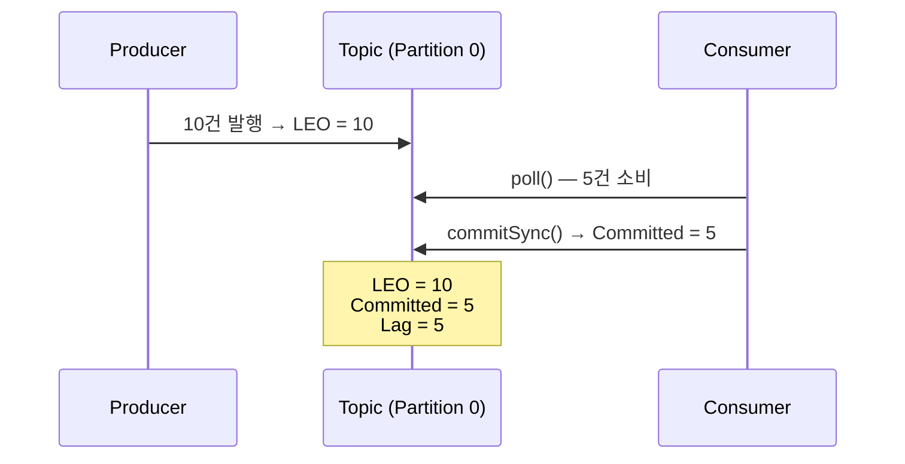
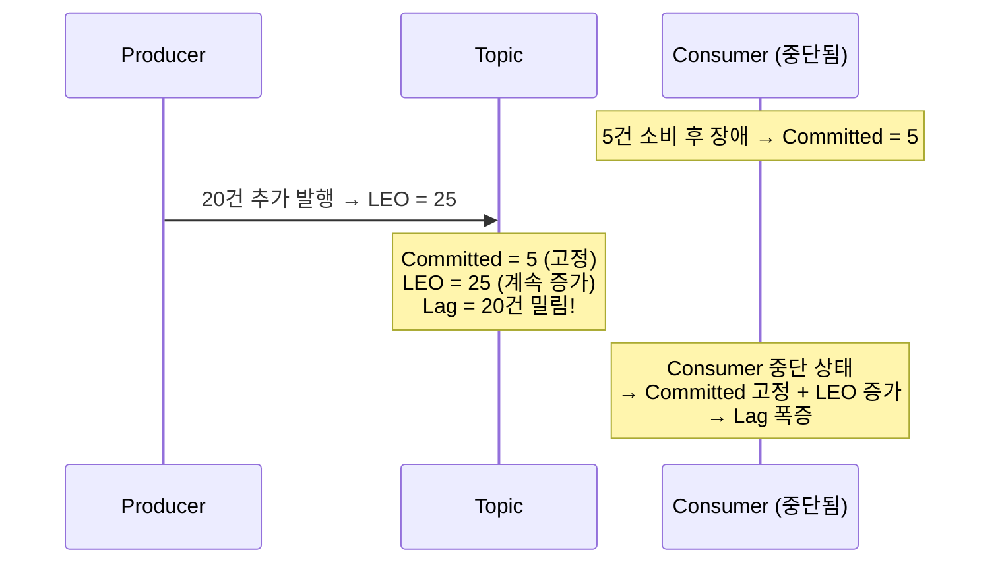
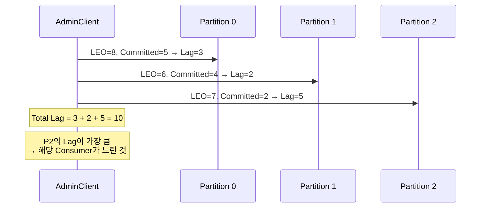
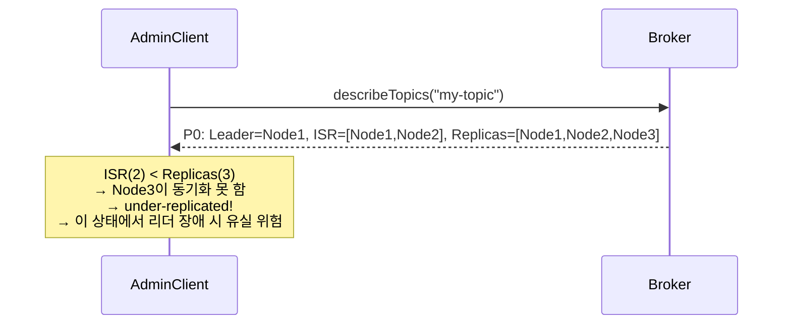

# Step 9 — Monitoring & Observability

---

## Consumer가 처리를 못 따라가는 걸 어떻게 알 수 있는가?

Step 8에서 Kafka Connect로 데이터 파이프라인을 구성했다. 근데 이 파이프라인이 제대로 동작하는지 **누가 감시하는가?**

운영 중에 Consumer가 장애를 일으켜 처리가 멈췄다. 아무도 모르고 있었다. Lag이 100만 건 쌓인 후에야 발견했다. **모니터링이 없었기 때문이다.**

이 Step에서는 Kafka 모니터링의 핵심 지표인 Consumer Lag부터, 클러스터 상태, 클라이언트 메트릭까지 확인한다.

---

## Consumer Lag — 가장 중요한 지표

Consumer Lag은 "아직 처리하지 못한 메시지 수"다. 공식은 단순하다.

```
Lag = Log End Offset (LEO) - Committed Offset
```



AdminClient의 `listConsumerGroupOffsets()`와 `listOffsets()`를 조합하면 프로그래밍 방식으로 Lag을 계산할 수 있다. 이것이 `kafka-consumer-groups.sh --describe`의 LAG 컬럼과 동일한 값이다.

```java
// LEO 조회: OffsetSpec.latest()를 명시해야 한다
admin.listOffsets(Map.of(tp, OffsetSpec.latest()))
```

> **ConsumerLagMonitoringTest** — `AdminClient로_Consumer_Lag을_계산할_수_있다()`에서 확인.

---

## Consumer가 멈추면 Lag이 폭증한다

Consumer가 중단된 상태에서 Producer가 계속 발행하면 어떻게 되는가?



Committed Offset은 Consumer가 커밋한 시점에 고정되고, LEO만 계속 증가한다. **Lag이 계속 커진다.** 이것이 Consumer 장애 시 가장 먼저 감지해야 하는 지표다.

> **ConsumerLagMonitoringTest** — `Consumer가_중단되면_lag이_계속_증가한다()`에서 확인.

---

## 멀티 파티션 — 파티션별 Lag 합산

토픽이 여러 파티션으로 구성되어 있으면, 파티션별 Lag을 합산해야 Consumer Group 전체의 밀림 정도를 알 수 있다.



파티션별 Lag 편차가 크면, 특정 Consumer 인스턴스에 문제가 있을 가능성이 높다.

> **ConsumerLagMonitoringTest** — `여러_파티션의_lag을_합산하여_전체_그룹_lag을_계산한다()`에서 확인.

---

## 클러스터 정보 — 브로커와 ISR

AdminClient로 클러스터 상태를 프로그래밍 방식으로 확인할 수 있다.

`describeCluster()`로 브로커 수, 컨트롤러 노드, 클러스터 ID를 조회한다. 브로커 수가 예상보다 적으면 즉시 알림을 발생시킬 수 있다.

> **BrokerMetricsTest** — `AdminClient로_클러스터_정보를_조회할_수_있다()`에서 확인.

`describeTopics()`로 파티션별 리더와 ISR(In-Sync Replicas)을 확인한다. **ISR이 Replicas보다 적으면 under-replicated 상태**다. 이 상태에서 리더 장애가 발생하면 데이터 유실 위험이 있다.



> **BrokerMetricsTest** — `AdminClient로_토픽의_파티션_리더와_ISR을_확인할_수_있다()`에서 확인.

---

## 클라이언트 메트릭 — Producer와 Consumer 성능

Producer의 `send()` 지연이 간헐적으로 발생하는데 원인을 모른다면? `KafkaProducer.metrics()`로 클라이언트 레벨 메트릭을 확인한다.

| 메트릭 | 의미 | 이상 징후 |
|--------|------|----------|
| `record-send-rate` | 초당 발행 레코드 수 | 감소 → 병목 |
| `request-latency-avg` | 평균 요청 지연 | 증가 → 브로커 과부하 |
| `record-error-rate` | 초당 에러 수 | 증가 → 브로커 장애 |
| `batch-size-avg` | 평균 배치 크기 | 작음 → linger.ms 조정 필요 |

> **BrokerMetricsTest** — `Producer_클라이언트_메트릭으로_발행_성능을_확인할_수_있다()`에서 확인.

Consumer 쪽도 마찬가지다.

| 메트릭 | 의미 | 이상 징후 |
|--------|------|----------|
| `records-consumed-rate` | 초당 소비 레코드 수 | 감소 → 처리 지연 |
| `records-lag-max` | 할당된 파티션 중 최대 Lag | 증가 → 처리 못 따라감 |
| `fetch-latency-avg` | 평균 fetch 지연 | 증가 → 브로커 응답 지연 |
| `fetch-rate` | 초당 fetch 횟수 | 감소 → 네트워크 문제 |

> **BrokerMetricsTest** — `Consumer_클라이언트_메트릭으로_소비_성능을_확인할_수_있다()`에서 확인.

### records-lag-max vs AdminClient Lag

`records-lag-max`는 Consumer 클라이언트가 **마지막 fetch 시점에 계산한** 가장 큰 파티션의 Lag이다. Consumer가 살아 있을 때만 갱신되고, **Consumer가 죽으면 이 메트릭 자체가 사라진다.**

AdminClient로 계산하는 Lag은 브로커 측 LEO와 committed offset의 차이다. **Consumer가 죽어도 계산 가능하다.**

Consumer가 죽은 상황에서 Lag을 감지하려면 AdminClient 방식이 필수다. 실무에서는 둘 다 수집하고, AdminClient Lag을 기준으로 알림을 건다.

---

## 이벤트 흐름 추적 — 분산 트레이싱

> 이 섹션은 테스트로 다루지 않는 **운영 참고 내용**이다. Step 1에서 다룬 `correlation-id` 헤더가 분산 트레이싱의 기초가 된다.

Lag과 메트릭은 "얼마나 밀려있는가", "얼마나 빠른가"를 알려준다. 하지만 이벤트 기반 시스템에서 **"이 에러가 어디서 시작된 건지"**를 찾으려면 다른 도구가 필요하다. 동기 호출은 스택 트레이스를 따라가면 되지만, 이벤트는 여기저기 돌아다니기 때문에 흐름 추적이 어렵다.

이때 사용하는 것이 **분산 트레이싱(Distributed Tracing)**이다.

```
traceId: 하나의 비즈니스 요청을 관통하는 고유 ID
spanId:  각 서비스/컴포넌트에서의 처리 단위

주문 API → Producer(traceId=abc, spanId=1)
         → Kafka Topic
         → Consumer(traceId=abc, spanId=2) → 포인트 적립
         → Consumer(traceId=abc, spanId=3) → 알림 발송
```

Producer가 메시지 헤더에 `traceId`를 넣고, Consumer가 이를 꺼내서 자기 처리에 이어붙이면, 전체 이벤트 흐름을 하나의 트레이스로 추적할 수 있다. OpenTelemetry, Zipkin, Jaeger 같은 도구가 이를 시각화해준다.

---

## 알림 조건 예시

| 메트릭 | 임계값 | 의미 |
|--------|-------|------|
| Consumer Lag > 10000 | 위험 | Consumer 처리 속도 부족 |
| Lag 증가율 > 100/sec | 경고 | Producer 급증 or Consumer 장애 |
| ISR < Replicas | 긴급 | under-replicated → 리더 장애 시 유실 위험 |
| request-latency-avg > 100ms | 경고 | 브로커 과부하 |

> Lag 증가율은 Kafka 기본 메트릭이 아니다. 모니터링 시스템(Prometheus 등)에서 Lag을 주기적으로 수집하고 변화량을 계산해야 한다.

## 운영 도구 대응

```bash
# Consumer Lag 확인 (Docker 컨테이너 안에서 실행)
docker exec kafka kafka-consumer-groups.sh --describe --group my-group --bootstrap-server localhost:9092

# 토픽 상태 확인
docker exec kafka kafka-topics.sh --describe --topic my-topic --bootstrap-server localhost:9092
```

---

## 스스로 답해보자

- Consumer Lag의 공식은? LEO와 Committed Offset은 각각 어디서 가져오는가?
- Consumer가 중단되면 Lag은 어떤 패턴으로 변하는가?
- 멀티 파티션에서 특정 파티션의 Lag만 높다면 무엇을 의심해야 하는가?
- ISR이 Replicas보다 적을 때 즉시 데이터가 유실되는가?
- Producer의 `request-latency-avg`가 급증하면 어떤 원인을 의심하는가?
- `records-lag-max`와 AdminClient로 계산한 Lag의 차이는? Consumer가 죽으면 어느 쪽이 감지 가능한가?

> 답이 바로 나오면 Step 10으로 넘어가자.
> 막히면 `ConsumerLagMonitoringTest`, `BrokerMetricsTest`를 실행해서 확인하자.

---

## 다음 Step으로

모니터링으로 문제를 감지하는 방법을 확인했다.
근데 `retention.ms`를 실수로 잘못 설정해서 데이터가 조기 삭제됐다면? 브로커를 재시작하지 않고 설정을 바꿀 수 있는가?

Step 10에서는 브로커 내부와 KRaft 모드를 다룬다.
"AdminClient로 동적 설정 변경이 가능한가?" — 이 질문에서 시작한다.