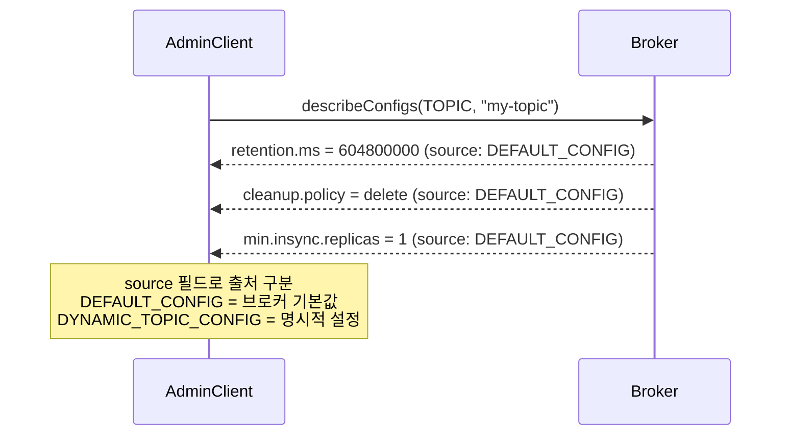
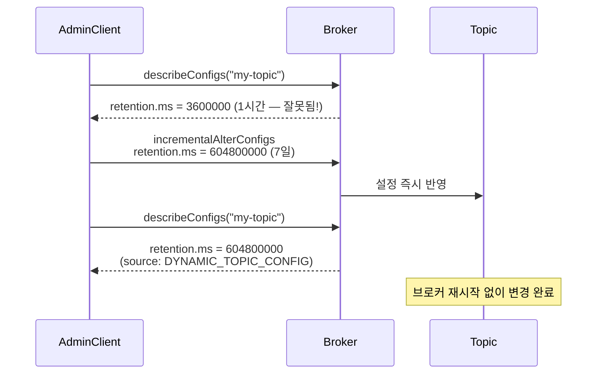
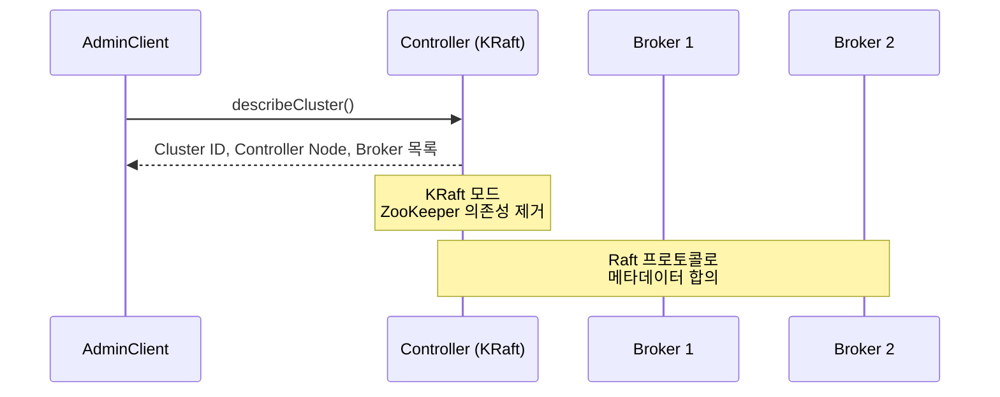
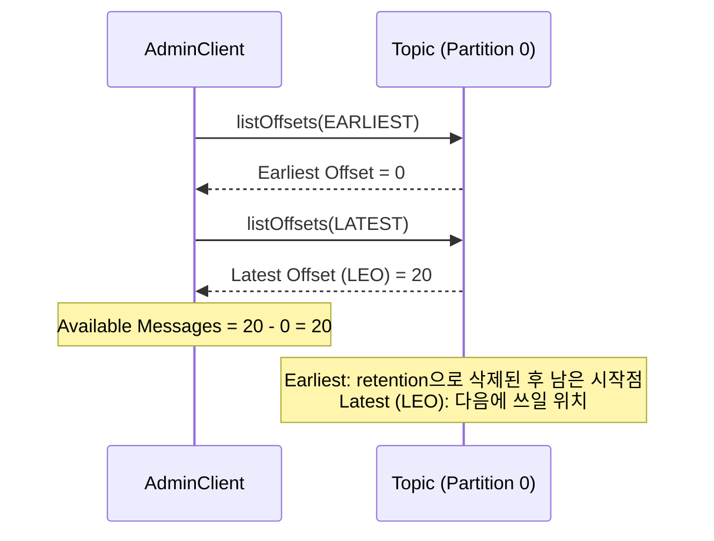

# Step 10 — Broker Internals & KRaft

> 클러스터, 컨트롤러(KRaft), 리플리케이션의 전체 그림은 [KAFKA-ARCHITECTURE.md](../../../../KAFKA-ARCHITECTURE.md)에서 상세히 다룬다. 이 Step의 테스트가 확인하는 것의 배경이다.

---

## retention.ms를 실수로 잘못 설정하면?

Step 9에서 모니터링으로 문제를 감지하는 방법을 확인했다. 이제 문제를 **직접 고치는** 단계다.

토픽의 `retention.ms`를 실수로 1시간으로 설정했다. 7일치 데이터가 필요한 토픽인데, 1시간이 지난 데이터가 전부 삭제됐다. 브로커를 재시작해야 설정을 바꿀 수 있는가?

**아니다. AdminClient로 브로커 재시작 없이 동적으로 변경할 수 있다.**

> ⚠️ retention.ms를 늘려도 **이미 삭제된 데이터는 복구되지 않는다.** 변경 시점 이후부터 새 보존 기간이 적용된다. 그래서 처음 설정할 때 신중해야 하고, 모니터링(Step 9)으로 조기에 감지하는 것이 중요하다.

---

## 토픽 설정 조회 — 무엇이 잘못됐는지 확인하기

먼저 현재 토픽의 설정을 확인한다. `describeConfigs()`로 `retention.ms`, `cleanup.policy`, `min.insync.replicas` 등 주요 설정값을 조회할 수 있다.



`source` 필드가 중요하다. `DEFAULT_CONFIG`이면 브로커의 기본값이고, `DYNAMIC_TOPIC_CONFIG`이면 누군가 명시적으로 변경한 값이다.

> **BrokerInternalsTest** — `AdminClient로_토픽_설정을_조회할_수_있다()`에서 확인.

---

## 토픽 설정 동적 변경 — 재시작 없이

`incrementalAlterConfigs()`로 토픽 설정을 즉시 변경한다. 브로커 재시작이 필요 없다.

> `incrementalAlterConfigs()`는 지정한 설정만 **부분 변경**하고 나머지는 유지한다. deprecated된 `alterConfigs()`는 지정한 설정으로 **전체 교체**하기 때문에, 명시하지 않은 설정이 기본값으로 리셋되는 사고가 발생할 수 있다. 항상 `incrementalAlterConfigs()`를 사용한다.



> **BrokerInternalsTest** — `AdminClient로_토픽_설정을_동적으로_변경할_수_있다()`에서 확인.

---

## KRaft 모드 — ZooKeeper 없는 Kafka

전통적으로 Kafka는 ZooKeeper에 메타데이터를 저장했다. 브로커 목록, 토픽 설정, 컨트롤러 선출 등을 ZooKeeper가 관리했다. 하지만 ZooKeeper는 별도 클러스터 운영이 필요하고, 장애 포인트가 추가된다.

KRaft(Kafka Raft) 모드에서는 Kafka 자체가 Raft 프로토콜로 메타데이터를 관리한다.

> 이 lab은 KRaft 단일 브로커 모드(`KAFKA_PROCESS_ROLES=broker,controller`)로 동작한다. 하나의 프로세스가 브로커와 컨트롤러를 겸한다.



`describeCluster()`로 컨트롤러 노드를 확인할 수 있다. 컨트롤러가 리더 선출, 토픽 관리 등을 담당한다.

> **BrokerInternalsTest** — `KRaft_모드에서_컨트롤러_노드를_확인할_수_있다()`에서 확인.

---

## 데이터 범위 — Earliest와 Latest Offset

토픽에 현재 어떤 데이터가 남아 있는지 확인하려면 Earliest Offset과 Latest Offset을 조회한다.



- **Earliest Offset**: 보존 정책에 따라 삭제되지 않은 가장 오래된 메시지의 offset
- **Latest Offset (LEO)**: 다음에 쓰일 offset
- 두 값의 차이 = 현재 토픽에 남아있는 읽을 수 있는 메시지 수

retention으로 오래된 데이터가 삭제되면 Earliest Offset이 올라간다.

> **BrokerInternalsTest** — `토픽의_Earliest와_Latest_Offset으로_데이터_범위를_확인한다()`에서 확인.

---

## 토픽 관리 — 목록 조회와 삭제

`listTopics()`로 클러스터의 전체 토픽을 조회하고, `deleteTopics()`로 불필요한 토픽을 정리할 수 있다. 테스트 토픽, 만료된 토픽을 자동 정리하는 데 활용한다.

> ⚠️ 토픽을 삭제하면 **모든 데이터가 영구 삭제되며 복구할 수 없다.** 삭제 전에 해당 토픽을 구독 중인 Consumer가 없는지 확인해야 한다.

> **BrokerInternalsTest** — `AdminClient로_토픽_목록을_조회하고_삭제할_수_있다()`에서 확인.

---

## 운영 도구 대응

```bash
# 토픽 설정 조회 (Docker 컨테이너 안에서 실행)
docker exec kafka kafka-configs.sh --describe --entity-type topics --entity-name my-topic \
  --bootstrap-server localhost:9092

# 토픽 설정 변경 (재시작 불필요)
docker exec kafka kafka-configs.sh --alter --entity-type topics --entity-name my-topic \
  --add-config retention.ms=86400000 --bootstrap-server localhost:9092

# 토픽 목록 조회
docker exec kafka kafka-topics.sh --list --bootstrap-server localhost:9092
```

---

## 스스로 답해보자

- 토픽의 `retention.ms`를 잘못 설정했을 때 브로커를 재시작해야 하는가?
- `retention.ms`를 늘리면 이미 삭제된 데이터가 복구되는가?
- `describeConfigs()`에서 source가 `DEFAULT_CONFIG`과 `DYNAMIC_TOPIC_CONFIG`인 것의 차이는?
- `incrementalAlterConfigs()`와 `alterConfigs()`의 차이는? 왜 전자를 써야 하는가?
- KRaft 모드에서 ZooKeeper가 하던 역할을 무엇이 대신하는가?
- Earliest Offset이 0이 아닌 경우는 어떤 상황인가?
- `deleteTopics()`로 토픽을 삭제하면 데이터는 어떻게 되는가?

> 답이 바로 나오면 이 여정을 마무리하자.
> 막히면 `BrokerInternalsTest`를 실행해서 확인하자.

---

## 여기까지 온 전체 여정

```
Step 1   Producer Guarantee       메시지를 안전하게 보내는 법
Step 2   Consumer Offset          메시지를 안전하게 처리하는 법
Step 3   Partition                 메시지를 분산하는 법
Step 4   Rebalancing              Consumer 장애를 버티는 법
Step 5   DLQ                      실패한 메시지를 다루는 법
Step 6   Exactly-Once             중복을 방지하는 법과 그 한계
Step 7   Serialization            메시지 구조가 변할 때 대응하는 법
Step 8   Kafka Connect            코드 없이 파이프라인을 만드는 법
Step 9   Monitoring               문제를 감지하는 법
Step 10  Broker Internals         문제를 직접 고치는 법
```

Step 1에서 `acks=all`이 왜 안전하지 않은지부터 시작해서, Step 10에서 브로커 설정을 동적으로 변경하는 것까지 왔다. 각 Step의 테스트를 직접 실행하고, "스스로 답해보자"에서 막히는 부분이 있으면 다시 돌아가서 확인하자.

Kafka는 설정의 조합이 동작을 결정하는 시스템이다. 하나의 설정이 아니라 **설정들의 조합**이 어떤 보장을 만드는지 이해하는 것이 핵심이다.